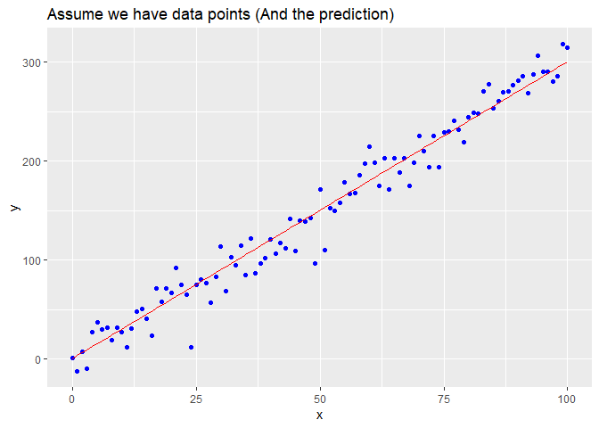

Day001
================

HW1
---

url &lt;- "<https://www.kaggle.com/spscientist/students-performance-in-exams/downloads/StudentsPerformance.csv>"

``` r
dat <- read.csv("data/StudentsPerformance.csv")
head(dat)
```

    ##   gender race.ethnicity parental.level.of.education        lunch
    ## 1 female        group B           bachelor's degree     standard
    ## 2 female        group C                some college     standard
    ## 3 female        group B             master's degree     standard
    ## 4   male        group A          associate's degree free/reduced
    ## 5   male        group C                some college     standard
    ## 6 female        group B          associate's degree     standard
    ##   test.preparation.course math.score reading.score writing.score
    ## 1                    none         72            72            74
    ## 2               completed         69            90            88
    ## 3                    none         90            95            93
    ## 4                    none         47            57            44
    ## 5                    none         76            78            75
    ## 6                    none         71            83            78

1.  The dataset is important for public interest
2.  The dataset is from Royse Kimmons website
3.  It's a structured data, including scores from three exams and a variety of personal, social, and economic factors
4.  The dataset aims to understand the influence of various factors like economic, personal and social on the students performance.

-   Inferences:
-   How to imporve the students performance in each test ?
-   What are the major factors influencing the test scores ?
-   Effectiveness of test preparation course?

HW2
---

HW3
---

``` r
MSE <- function(y, yp) {
  mse <- sum((y-yp)^2)/length(y)
  return(mse)
}

MAE <- function(y, yp) {
  mae <- sum(abs(y-yp))/length(y)
  return(mae)
}
```

``` r
library(ggplot2)
w <- 3
b <- 0.5

x_lin <- seq(0, 100, length.out=101)

y <- (x_lin + rnorm(101) * 5) * w + b

ggplot()+
  geom_point(aes(x_lin,y),color="blue")+
  labs(title="Assume we have data points")+
  geom_smooth(method='lm',se=FALSE,col="red")
```


``` r
y_hat = x_lin * w + b

df <- data.frame(x=x_lin,y=y,y_hat=y_hat)

ggplot(df)+
  geom_point(aes(x,y), color="blue")+
  geom_line(aes(x,y_hat), color="red")+
  labs(title="Assume we have data points (And the prediction)")
```



``` r
str1 <- paste("The Mean squared error is", sprintf("%.3f",(MSE(y,y_hat))))
str2 <- paste("The Mean absolute error is", sprintf("%.3f",(MAE(y,y_hat))))
cat(str1,str2, sep ="\n")
```

    ## The Mean squared error is 200.156
    ## The Mean absolute error is 11.419
