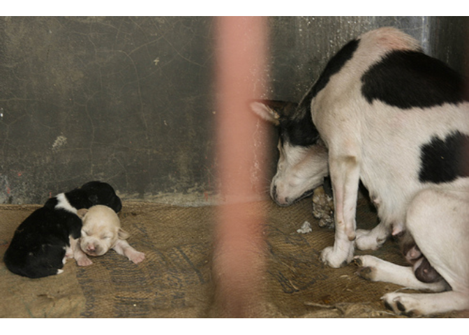
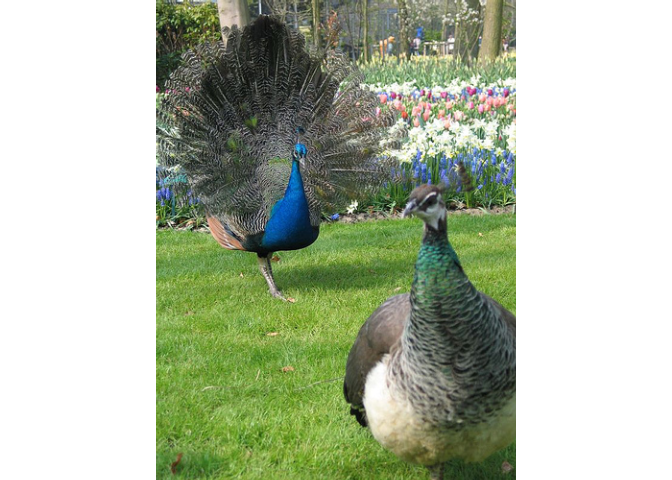
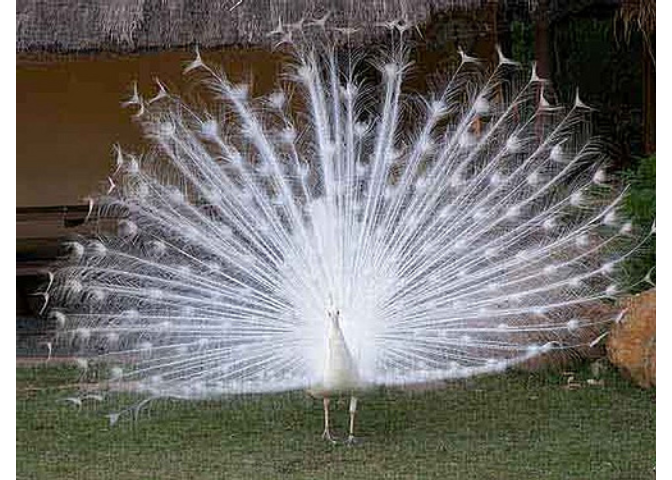

Day003-1
================

Packages loading

``` r
library(tidyverse)
library(magrittr)
library(jpeg)
library(cowplot)
library(magick)
```

Loading text file

``` r
url <- "https://raw.githubusercontent.com/vashineyu/slides_and_others/master/tutorial/examples/imagenet_urls_examples.txt"
dat <- read.delim(url, header = FALSE, stringsAsFactors = FALSE)
class(dat)
```

    ## [1] "data.frame"

Rename the columns

``` r
dat <- set_colnames(dat, c("id", "url"))
head(dat)
```

    ##              id
    ## 1 n00015388_157
    ## 2 n00015388_238
    ## 3 n00015388_304
    ## 4 n00015388_327
    ## 5 n00015388_355
    ## 6 n00015388_373
    ##                                                             url
    ## 1   http://farm1.static.flickr.com/145/430300483_21e993670c.jpg
    ## 2 http://farm2.static.flickr.com/1005/3352960681_37b9c1d27b.jpg
    ## 3     http://farm1.static.flickr.com/27/51009336_a9663af3dd.jpg
    ## 4 http://farm4.static.flickr.com/3025/2444687979_bf7bc8df21.jpg
    ## 5     http://img100.imageshack.us/img100/3253/forrest004fs9.jpg
    ## 6      http://img172.imageshack.us/img172/4606/napo03072en9.jpg

Try to catch the image

``` r
result <- 1:5 %>% 
  map(function(i) {
    tryCatch({
      ggdraw() +
      draw_image(dat$url[i])
    }, error = function(msg) {
      message(paste("image",i,"not found","\n"))
    })
  })
```

    ## image 5 not found

Number of pictures we finally get

``` r
n <- 0
for(i in seq_along(result)) {
  n <- n + sum(is.null(result[[i]]))
}

print(paste("Total images that we got:",length(result)-n))
```

    ## [1] "Total images that we got: 4"

Show the image

``` r
result
```


