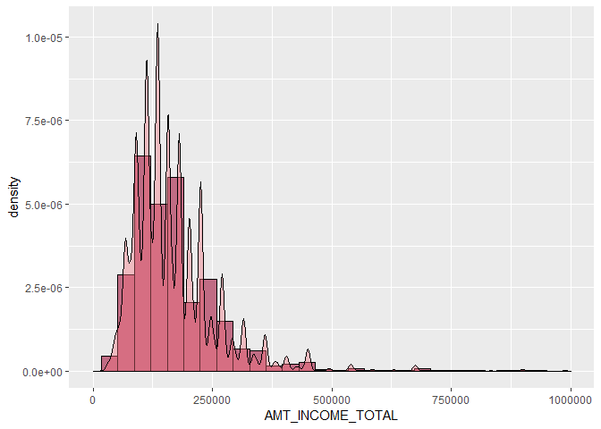
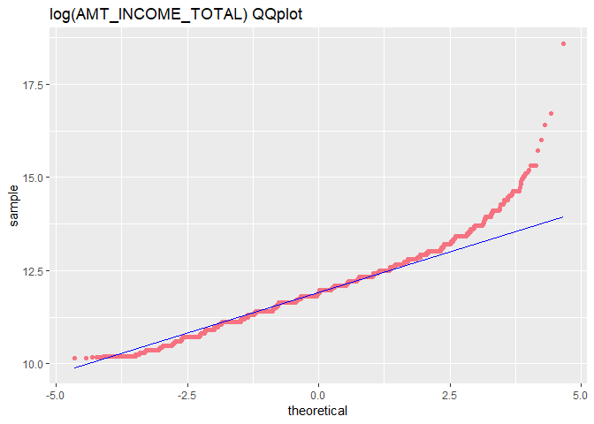

Day005
================

``` r
library(tidyverse)
library(magrittr)
library(ggplot2)
```

``` r
dat <- read.csv("data/application_train.csv")
glimpse(dat)
```

    ## Observations: 307,511
    ## Variables: 122
    ## $ SK_ID_CURR                   <int> 100002, 100003, 100004, 100006, 1...
    ## $ TARGET                       <int> 1, 0, 0, 0, 0, 0, 0, 0, 0, 0, 0, ...
    ## $ NAME_CONTRACT_TYPE           <fct> Cash loans, Cash loans, Revolving...
    ## $ CODE_GENDER                  <fct> M, F, M, F, M, M, F, M, F, M, F, ...
    ## $ FLAG_OWN_CAR                 <fct> N, N, Y, N, N, N, Y, Y, N, N, N, ...
    ## $ FLAG_OWN_REALTY              <fct> Y, N, Y, Y, Y, Y, Y, Y, Y, Y, Y, ...
    ## $ CNT_CHILDREN                 <int> 0, 0, 0, 0, 0, 0, 1, 0, 0, 0, 1, ...
    ## $ AMT_INCOME_TOTAL             <dbl> 202500.00, 270000.00, 67500.00, 1...
    ## $ AMT_CREDIT                   <dbl> 406597.5, 1293502.5, 135000.0, 31...
    ## $ AMT_ANNUITY                  <dbl> 24700.5, 35698.5, 6750.0, 29686.5...
    ## $ AMT_GOODS_PRICE              <dbl> 351000, 1129500, 135000, 297000, ...
    ## $ NAME_TYPE_SUITE              <fct> Unaccompanied, Family, Unaccompan...
    ## $ NAME_INCOME_TYPE             <fct> Working, State servant, Working, ...
    ## $ NAME_EDUCATION_TYPE          <fct> Secondary / secondary special, Hi...
    ## $ NAME_FAMILY_STATUS           <fct> Single / not married, Married, Si...
    ## $ NAME_HOUSING_TYPE            <fct> House / apartment, House / apartm...
    ## $ REGION_POPULATION_RELATIVE   <dbl> 0.018801, 0.003541, 0.010032, 0.0...
    ## $ DAYS_BIRTH                   <int> -9461, -16765, -19046, -19005, -1...
    ## $ DAYS_EMPLOYED                <int> -637, -1188, -225, -3039, -3038, ...
    ## $ DAYS_REGISTRATION            <dbl> -3648, -1186, -4260, -9833, -4311...
    ## $ DAYS_ID_PUBLISH              <int> -2120, -291, -2531, -2437, -3458,...
    ## $ OWN_CAR_AGE                  <dbl> NA, NA, 26, NA, NA, NA, 17, 8, NA...
    ## $ FLAG_MOBIL                   <int> 1, 1, 1, 1, 1, 1, 1, 1, 1, 1, 1, ...
    ## $ FLAG_EMP_PHONE               <int> 1, 1, 1, 1, 1, 1, 1, 1, 0, 1, 1, ...
    ## $ FLAG_WORK_PHONE              <int> 0, 0, 1, 0, 0, 1, 0, 1, 0, 0, 0, ...
    ## $ FLAG_CONT_MOBILE             <int> 1, 1, 1, 1, 1, 1, 1, 1, 1, 1, 1, ...
    ## $ FLAG_PHONE                   <int> 1, 1, 1, 0, 0, 1, 1, 0, 0, 0, 0, ...
    ## $ FLAG_EMAIL                   <int> 0, 0, 0, 0, 0, 0, 0, 0, 0, 0, 0, ...
    ## $ OCCUPATION_TYPE              <fct> Laborers, Core staff, Laborers, L...
    ## $ CNT_FAM_MEMBERS              <dbl> 1, 2, 1, 2, 1, 2, 3, 2, 2, 1, 3, ...
    ## $ REGION_RATING_CLIENT         <int> 2, 1, 2, 2, 2, 2, 2, 3, 2, 2, 2, ...
    ## $ REGION_RATING_CLIENT_W_CITY  <int> 2, 1, 2, 2, 2, 2, 2, 3, 2, 2, 2, ...
    ## $ WEEKDAY_APPR_PROCESS_START   <fct> WEDNESDAY, MONDAY, MONDAY, WEDNES...
    ## $ HOUR_APPR_PROCESS_START      <int> 10, 11, 9, 17, 11, 16, 16, 16, 14...
    ## $ REG_REGION_NOT_LIVE_REGION   <int> 0, 0, 0, 0, 0, 0, 0, 0, 0, 0, 0, ...
    ## $ REG_REGION_NOT_WORK_REGION   <int> 0, 0, 0, 0, 0, 0, 0, 0, 0, 0, 0, ...
    ## $ LIVE_REGION_NOT_WORK_REGION  <int> 0, 0, 0, 0, 0, 0, 0, 0, 0, 0, 0, ...
    ## $ REG_CITY_NOT_LIVE_CITY       <int> 0, 0, 0, 0, 0, 0, 0, 0, 0, 0, 0, ...
    ## $ REG_CITY_NOT_WORK_CITY       <int> 0, 0, 0, 0, 1, 0, 0, 1, 0, 0, 0, ...
    ## $ LIVE_CITY_NOT_WORK_CITY      <int> 0, 0, 0, 0, 1, 0, 0, 1, 0, 0, 0, ...
    ## $ ORGANIZATION_TYPE            <fct> Business Entity Type 3, School, G...
    ## $ EXT_SOURCE_1                 <dbl> 0.08303697, 0.31126731, NA, NA, N...
    ## $ EXT_SOURCE_2                 <dbl> 0.2629486, 0.6222458, 0.5559121, ...
    ## $ EXT_SOURCE_3                 <dbl> 0.13937578, NA, 0.72956669, NA, N...
    ## $ APARTMENTS_AVG               <dbl> 0.0247, 0.0959, NA, NA, NA, NA, N...
    ## $ BASEMENTAREA_AVG             <dbl> 0.0369, 0.0529, NA, NA, NA, NA, N...
    ## $ YEARS_BEGINEXPLUATATION_AVG  <dbl> 0.9722, 0.9851, NA, NA, NA, NA, N...
    ## $ YEARS_BUILD_AVG              <dbl> 0.6192, 0.7960, NA, NA, NA, NA, N...
    ## $ COMMONAREA_AVG               <dbl> 0.0143, 0.0605, NA, NA, NA, NA, N...
    ## $ ELEVATORS_AVG                <dbl> 0.00, 0.08, NA, NA, NA, NA, NA, N...
    ## $ ENTRANCES_AVG                <dbl> 0.0690, 0.0345, NA, NA, NA, NA, N...
    ## $ FLOORSMAX_AVG                <dbl> 0.0833, 0.2917, NA, NA, NA, NA, N...
    ## $ FLOORSMIN_AVG                <dbl> 0.1250, 0.3333, NA, NA, NA, NA, N...
    ## $ LANDAREA_AVG                 <dbl> 0.0369, 0.0130, NA, NA, NA, NA, N...
    ## $ LIVINGAPARTMENTS_AVG         <dbl> 0.0202, 0.0773, NA, NA, NA, NA, N...
    ## $ LIVINGAREA_AVG               <dbl> 0.0190, 0.0549, NA, NA, NA, NA, N...
    ## $ NONLIVINGAPARTMENTS_AVG      <dbl> 0.0000, 0.0039, NA, NA, NA, NA, N...
    ## $ NONLIVINGAREA_AVG            <dbl> 0.0000, 0.0098, NA, NA, NA, NA, N...
    ## $ APARTMENTS_MODE              <dbl> 0.0252, 0.0924, NA, NA, NA, NA, N...
    ## $ BASEMENTAREA_MODE            <dbl> 0.0383, 0.0538, NA, NA, NA, NA, N...
    ## $ YEARS_BEGINEXPLUATATION_MODE <dbl> 0.9722, 0.9851, NA, NA, NA, NA, N...
    ## $ YEARS_BUILD_MODE             <dbl> 0.6341, 0.8040, NA, NA, NA, NA, N...
    ## $ COMMONAREA_MODE              <dbl> 0.0144, 0.0497, NA, NA, NA, NA, N...
    ## $ ELEVATORS_MODE               <dbl> 0.0000, 0.0806, NA, NA, NA, NA, N...
    ## $ ENTRANCES_MODE               <dbl> 0.0690, 0.0345, NA, NA, NA, NA, N...
    ## $ FLOORSMAX_MODE               <dbl> 0.0833, 0.2917, NA, NA, NA, NA, N...
    ## $ FLOORSMIN_MODE               <dbl> 0.1250, 0.3333, NA, NA, NA, NA, N...
    ## $ LANDAREA_MODE                <dbl> 0.0377, 0.0128, NA, NA, NA, NA, N...
    ## $ LIVINGAPARTMENTS_MODE        <dbl> 0.0220, 0.0790, NA, NA, NA, NA, N...
    ## $ LIVINGAREA_MODE              <dbl> 0.0198, 0.0554, NA, NA, NA, NA, N...
    ## $ NONLIVINGAPARTMENTS_MODE     <dbl> 0.0000, 0.0000, NA, NA, NA, NA, N...
    ## $ NONLIVINGAREA_MODE           <dbl> 0.0000, 0.0000, NA, NA, NA, NA, N...
    ## $ APARTMENTS_MEDI              <dbl> 0.0250, 0.0968, NA, NA, NA, NA, N...
    ## $ BASEMENTAREA_MEDI            <dbl> 0.0369, 0.0529, NA, NA, NA, NA, N...
    ## $ YEARS_BEGINEXPLUATATION_MEDI <dbl> 0.9722, 0.9851, NA, NA, NA, NA, N...
    ## $ YEARS_BUILD_MEDI             <dbl> 0.6243, 0.7987, NA, NA, NA, NA, N...
    ## $ COMMONAREA_MEDI              <dbl> 0.0144, 0.0608, NA, NA, NA, NA, N...
    ## $ ELEVATORS_MEDI               <dbl> 0.00, 0.08, NA, NA, NA, NA, NA, N...
    ## $ ENTRANCES_MEDI               <dbl> 0.0690, 0.0345, NA, NA, NA, NA, N...
    ## $ FLOORSMAX_MEDI               <dbl> 0.0833, 0.2917, NA, NA, NA, NA, N...
    ## $ FLOORSMIN_MEDI               <dbl> 0.1250, 0.3333, NA, NA, NA, NA, N...
    ## $ LANDAREA_MEDI                <dbl> 0.0375, 0.0132, NA, NA, NA, NA, N...
    ## $ LIVINGAPARTMENTS_MEDI        <dbl> 0.0205, 0.0787, NA, NA, NA, NA, N...
    ## $ LIVINGAREA_MEDI              <dbl> 0.0193, 0.0558, NA, NA, NA, NA, N...
    ## $ NONLIVINGAPARTMENTS_MEDI     <dbl> 0.0000, 0.0039, NA, NA, NA, NA, N...
    ## $ NONLIVINGAREA_MEDI           <dbl> 0.0000, 0.0100, NA, NA, NA, NA, N...
    ## $ FONDKAPREMONT_MODE           <fct> reg oper account, reg oper accoun...
    ## $ HOUSETYPE_MODE               <fct> block of flats, block of flats, ,...
    ## $ TOTALAREA_MODE               <dbl> 0.0149, 0.0714, NA, NA, NA, NA, N...
    ## $ WALLSMATERIAL_MODE           <fct> Stone, brick, Block, , , , , , , ...
    ## $ EMERGENCYSTATE_MODE          <fct> No, No, , , , , , , , , , , No, N...
    ## $ OBS_30_CNT_SOCIAL_CIRCLE     <dbl> 2, 1, 0, 2, 0, 0, 1, 2, 1, 2, 0, ...
    ## $ DEF_30_CNT_SOCIAL_CIRCLE     <dbl> 2, 0, 0, 0, 0, 0, 0, 0, 0, 0, 0, ...
    ## $ OBS_60_CNT_SOCIAL_CIRCLE     <dbl> 2, 1, 0, 2, 0, 0, 1, 2, 1, 2, 0, ...
    ## $ DEF_60_CNT_SOCIAL_CIRCLE     <dbl> 2, 0, 0, 0, 0, 0, 0, 0, 0, 0, 0, ...
    ## $ DAYS_LAST_PHONE_CHANGE       <dbl> -1134, -828, -815, -617, -1106, -...
    ## $ FLAG_DOCUMENT_2              <int> 0, 0, 0, 0, 0, 0, 0, 0, 0, 0, 0, ...
    ## $ FLAG_DOCUMENT_3              <int> 1, 1, 0, 1, 0, 1, 0, 1, 1, 0, 1, ...
    ## $ FLAG_DOCUMENT_4              <int> 0, 0, 0, 0, 0, 0, 0, 0, 0, 0, 0, ...
    ## $ FLAG_DOCUMENT_5              <int> 0, 0, 0, 0, 0, 0, 0, 0, 0, 0, 0, ...
    ## $ FLAG_DOCUMENT_6              <int> 0, 0, 0, 0, 0, 0, 0, 0, 0, 0, 0, ...
    ## $ FLAG_DOCUMENT_7              <int> 0, 0, 0, 0, 0, 0, 0, 0, 0, 0, 0, ...
    ## $ FLAG_DOCUMENT_8              <int> 0, 0, 0, 0, 1, 0, 1, 0, 0, 0, 0, ...
    ## $ FLAG_DOCUMENT_9              <int> 0, 0, 0, 0, 0, 0, 0, 0, 0, 0, 0, ...
    ## $ FLAG_DOCUMENT_10             <int> 0, 0, 0, 0, 0, 0, 0, 0, 0, 0, 0, ...
    ## $ FLAG_DOCUMENT_11             <int> 0, 0, 0, 0, 0, 0, 0, 0, 0, 0, 0, ...
    ## $ FLAG_DOCUMENT_12             <int> 0, 0, 0, 0, 0, 0, 0, 0, 0, 0, 0, ...
    ## $ FLAG_DOCUMENT_13             <int> 0, 0, 0, 0, 0, 0, 0, 0, 0, 0, 0, ...
    ## $ FLAG_DOCUMENT_14             <int> 0, 0, 0, 0, 0, 0, 1, 0, 0, 0, 0, ...
    ## $ FLAG_DOCUMENT_15             <int> 0, 0, 0, 0, 0, 0, 0, 0, 0, 0, 0, ...
    ## $ FLAG_DOCUMENT_16             <int> 0, 0, 0, 0, 0, 0, 0, 0, 0, 0, 0, ...
    ## $ FLAG_DOCUMENT_17             <int> 0, 0, 0, 0, 0, 0, 0, 0, 0, 0, 0, ...
    ## $ FLAG_DOCUMENT_18             <int> 0, 0, 0, 0, 0, 0, 0, 0, 0, 0, 0, ...
    ## $ FLAG_DOCUMENT_19             <int> 0, 0, 0, 0, 0, 0, 0, 0, 0, 0, 0, ...
    ## $ FLAG_DOCUMENT_20             <int> 0, 0, 0, 0, 0, 0, 0, 0, 0, 0, 0, ...
    ## $ FLAG_DOCUMENT_21             <int> 0, 0, 0, 0, 0, 0, 0, 0, 0, 0, 0, ...
    ## $ AMT_REQ_CREDIT_BUREAU_HOUR   <dbl> 0, 0, 0, NA, 0, 0, 0, 0, 0, NA, 0...
    ## $ AMT_REQ_CREDIT_BUREAU_DAY    <dbl> 0, 0, 0, NA, 0, 0, 0, 0, 0, NA, 0...
    ## $ AMT_REQ_CREDIT_BUREAU_WEEK   <dbl> 0, 0, 0, NA, 0, 0, 0, 0, 0, NA, 0...
    ## $ AMT_REQ_CREDIT_BUREAU_MON    <dbl> 0, 0, 0, NA, 0, 0, 1, 0, 0, NA, 1...
    ## $ AMT_REQ_CREDIT_BUREAU_QRT    <dbl> 0, 0, 0, NA, 0, 1, 1, 0, 0, NA, 0...
    ## $ AMT_REQ_CREDIT_BUREAU_YEAR   <dbl> 1, 0, 0, NA, 0, 1, 2, 0, 1, NA, 0...

``` r
dat %>% 
  select(AMT_INCOME_TOTAL) %>%
  summarise(n = n(),
            Min = min(AMT_INCOME_TOTAL),
            Q25 = quantile(AMT_INCOME_TOTAL, .25),
            Median = median(AMT_INCOME_TOTAL),
            Q75 = quantile(AMT_INCOME_TOTAL, .75),
            Max = max(AMT_INCOME_TOTAL),
            Mean = mean(AMT_INCOME_TOTAL),
            Sd = sd(AMT_INCOME_TOTAL)) 
```

    ##        n   Min    Q25 Median    Q75      Max     Mean       Sd
    ## 1 307511 25650 112500 147150 202500 1.17e+08 168797.9 237123.1

``` r
dat %>% 
  ggplot(aes(x = AMT_INCOME_TOTAL))+
  geom_histogram(aes(y=..density..), colour="black", fill="#C06C84")+
  geom_density(alpha=.4, fill="#F67280")+
  xlim(0,1e6)
```

    ## `stat_bin()` using `bins = 30`. Pick better value with `binwidth`.



``` r
dat %>% 
  ggplot(aes(sample = log(AMT_INCOME_TOTAL)))+
  geom_qq(distribution = stats::qnorm, colour="#F67280")+
  stat_qq_line(color="blue")+
  labs(title = "log(AMT_INCOME_TOTAL) QQplot")
```


