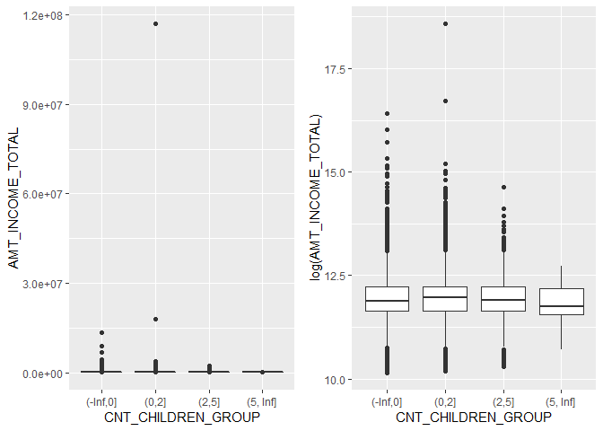
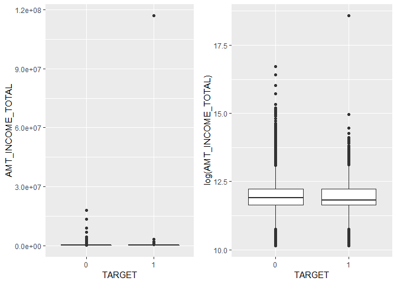

Day008
================

``` r
library(magrittr)
library(tidyverse)
library(gridExtra)
```

1. 請將 app\_train 中的 CNT\_CHILDREN 依照下列規則分為四組，並將其結果在原本的 dataframe 命名為 CNT\_CHILDREN\_GROUP
--------------------------------------------------------------------------------------------------------------------

``` r
app_train <- read.csv("data/application_train.csv")
```

``` r
breaks <- c(-Inf,0,2,5,Inf)
app_train <- mutate(app_train, CNT_CHILDREN_GROUP = cut(CNT_CHILDREN, breaks = breaks))
```

2. 請根據 CNT\_CHILDREN\_GROUP 以及 TARGET，列出各組的平均 AMT\_INCOME\_TOTAL，並繪製 boxplot
---------------------------------------------------------------------------------------------

``` r
app_train %>% 
  group_by(CNT_CHILDREN_GROUP) %>%
  summarise(mean(AMT_INCOME_TOTAL))
```

    ## # A tibble: 4 x 2
    ##   CNT_CHILDREN_GROUP `mean(AMT_INCOME_TOTAL)`
    ##   <fct>                                 <dbl>
    ## 1 (-Inf,0]                            166289.
    ## 2 (0,2]                               174726.
    ## 3 (2,5]                               173626.
    ## 4 (5, Inf]                            147911.

``` r
p1 <- ggplot(data = app_train) +
  geom_boxplot(aes(x=CNT_CHILDREN_GROUP, y=AMT_INCOME_TOTAL)) 

p2 <- ggplot(data = app_train) +
  geom_boxplot(aes(x=CNT_CHILDREN_GROUP, y=log(AMT_INCOME_TOTAL)))

grid.arrange(p1,p2,ncol=2)
```



``` r
app_train %>% 
  group_by(TARGET) %>%
  summarise(mean(AMT_INCOME_TOTAL))
```

    ## # A tibble: 2 x 2
    ##   TARGET `mean(AMT_INCOME_TOTAL)`
    ##    <int>                    <dbl>
    ## 1      0                  169078.
    ## 2      1                  165612.

``` r
app_train$TARGET <- as.factor(app_train$TARGET)

p3 <- ggplot(data = app_train) +
  geom_boxplot(aes(x=TARGET, y=AMT_INCOME_TOTAL)) 

p4 <- ggplot(data = app_train) +
  geom_boxplot(aes(x=TARGET, y=log(AMT_INCOME_TOTAL)))

grid.arrange(p3,p4,ncol=2)
```



3. 請根據 CNT\_CHILDREN\_GROUP 以及 TARGET，對 AMT\_INCOME\_TOTAL 計算 Z 轉換 後的分數
--------------------------------------------------------------------------------------

``` r
app_train %>% 
  group_by(CNT_CHILDREN_GROUP) %>%
  mutate(GROUP_MEAN = mean(AMT_INCOME_TOTAL),
         GROUP_SD = sd(AMT_INCOME_TOTAL)) %>%
  mutate(Z_TRANSFORM = (AMT_INCOME_TOTAL - GROUP_MEAN) / GROUP_SD) %>%
  select(CNT_CHILDREN_GROUP ,AMT_INCOME_TOTAL, GROUP_MEAN, GROUP_SD, Z_TRANSFORM) %>%
  head()
```

    ## # A tibble: 6 x 5
    ## # Groups:   CNT_CHILDREN_GROUP [1]
    ##   CNT_CHILDREN_GROUP AMT_INCOME_TOTAL GROUP_MEAN GROUP_SD Z_TRANSFORM
    ##   <fct>                         <dbl>      <dbl>    <dbl>       <dbl>
    ## 1 (-Inf,0]                     202500    166289.  104700.       0.346
    ## 2 (-Inf,0]                     270000    166289.  104700.       0.991
    ## 3 (-Inf,0]                      67500    166289.  104700.      -0.944
    ## 4 (-Inf,0]                     135000    166289.  104700.      -0.299
    ## 5 (-Inf,0]                     121500    166289.  104700.      -0.428
    ## 6 (-Inf,0]                      99000    166289.  104700.      -0.643

``` r
app_train %>% 
  group_by(TARGET) %>%
  mutate(GROUP_MEAN = mean(AMT_INCOME_TOTAL),
         GROUP_SD = sd(AMT_INCOME_TOTAL)) %>%
  mutate(Z_TRANSFORM = (AMT_INCOME_TOTAL - GROUP_MEAN) / GROUP_SD) %>%
  select(TARGET, AMT_INCOME_TOTAL, GROUP_MEAN, GROUP_SD, Z_TRANSFORM) %>%
  head()
```

    ## # A tibble: 6 x 5
    ## # Groups:   TARGET [2]
    ##   TARGET AMT_INCOME_TOTAL GROUP_MEAN GROUP_SD Z_TRANSFORM
    ##   <fct>             <dbl>      <dbl>    <dbl>       <dbl>
    ## 1 1                202500    165612.  746677.      0.0494
    ## 2 0                270000    169078.  110476.      0.914 
    ## 3 0                 67500    169078.  110476.     -0.919 
    ## 4 0                135000    169078.  110476.     -0.308 
    ## 5 0                121500    169078.  110476.     -0.431 
    ## 6 0                 99000    169078.  110476.     -0.634
