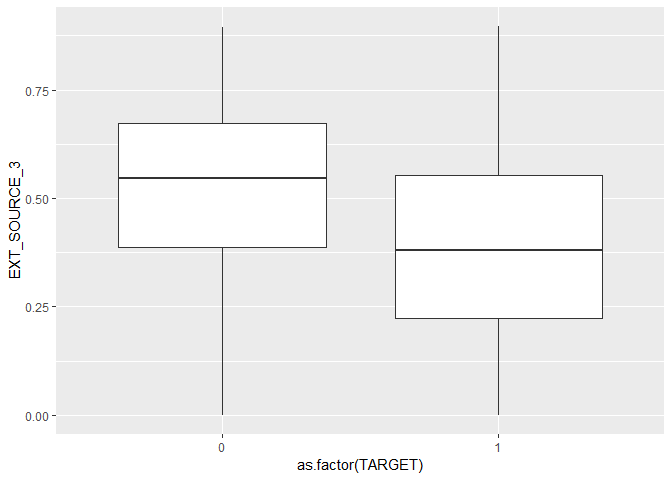

Day010
================

``` r
library(magrittr)
library(purrr)
library(plyr)
library(tidyverse)
library(gridExtra)
```

Data loading

``` r
app_train <- read.csv("data/application_train.csv")
app_test <- read.csv("data/application_train.csv")
```

Label encoding

``` r
feature.names <- colnames(app_train)
count <- 0

# Iterate through the columns
for (f in feature.names) {
    if (class(app_train[[f]]) == 'factor') {
        if (nlevels(app_train[[f]]) <= 2) {
        levels <- list(app_train[[f]], app_test[[f]]) %>% unlist() %>% levels()
        app_train[[f]] <- mapvalues(app_train[[f]], from=levels, to=c(1,2)) %>% as.integer()
        app_test[[f]] <- mapvalues(app_test[[f]], from=levels, to=c(1,2)) %>% as.integer()
        count <- count + 1
        }
    }
}

print(paste(count,"labels were label encoded."))
```

    ## [1] "3 labels were label encoded."

``` r
# Create an anomalous flag column
app_train$DAYS_EMPLOYED_ANOM <- app_train$DAYS_EMPLOYED == 365243
app_train$DAYS_EMPLOYED[which(app_train$DAYS_EMPLOYED == 365243)] <- NA

# also apply to testing dataset
app_test$DAYS_EMPLOYED_ANOM <- app_test$DAYS_EMPLOYED == 365243
app_test$DAYS_EMPLOYED[which(app_test$DAYS_EMPLOYED == 365243)] <- NA

# absolute the value of DAYS_BIRTH
app_train$DAYS_BIRTH <- abs(app_train$DAYS_BIRTH)
app_test$DAYS_BIRTH <- abs(app_test$DAYS_BIRTH)
```

Correlation with Target

``` r
(corr <- cor(map(app_train, as.numeric) %>% as.data.frame(), app_train$TARGET, use = "pairwise.complete.obs"))
```

    ##                                       [,1]
    ## SK_ID_CURR                   -0.0021084690
    ## TARGET                        1.0000000000
    ## NAME_CONTRACT_TYPE           -0.0308959082
    ## CODE_GENDER                   0.0546922619
    ## FLAG_OWN_CAR                 -0.0218509385
    ## FLAG_OWN_REALTY              -0.0061483877
    ## CNT_CHILDREN                  0.0191871336
    ## AMT_INCOME_TOTAL             -0.0039818656
    ## AMT_CREDIT                   -0.0303692865
    ## AMT_ANNUITY                  -0.0128165615
    ## AMT_GOODS_PRICE              -0.0396452812
    ## NAME_TYPE_SUITE               0.0096928202
    ## NAME_INCOME_TYPE              0.0468294338
    ## NAME_EDUCATION_TYPE           0.0546986016
    ## NAME_FAMILY_STATUS           -0.0041272264
    ## NAME_HOUSING_TYPE             0.0344886029
    ## REGION_POPULATION_RELATIVE   -0.0372271485
    ## DAYS_BIRTH                   -0.0782393083
    ## DAYS_EMPLOYED                 0.0749584574
    ## DAYS_REGISTRATION             0.0419748628
    ## DAYS_ID_PUBLISH               0.0514571726
    ## OWN_CAR_AGE                   0.0376115643
    ## FLAG_MOBIL                    0.0005343956
    ## FLAG_EMP_PHONE                0.0459822197
    ## FLAG_WORK_PHONE               0.0285243224
    ## FLAG_CONT_MOBILE              0.0003701268
    ## FLAG_PHONE                   -0.0238062723
    ## FLAG_EMAIL                   -0.0017583834
    ## OCCUPATION_TYPE               0.0414190346
    ## CNT_FAM_MEMBERS               0.0093077844
    ## REGION_RATING_CLIENT          0.0588990149
    ## REGION_RATING_CLIENT_W_CITY   0.0608926676
    ## WEEKDAY_APPR_PROCESS_START    0.0040017453
    ## HOUR_APPR_PROCESS_START      -0.0241658314
    ## REG_REGION_NOT_LIVE_REGION    0.0055759445
    ## REG_REGION_NOT_WORK_REGION    0.0069419075
    ## LIVE_REGION_NOT_WORK_REGION   0.0028194792
    ## REG_CITY_NOT_LIVE_CITY        0.0443953748
    ## REG_CITY_NOT_WORK_CITY        0.0509944644
    ## LIVE_CITY_NOT_WORK_CITY       0.0325183411
    ## ORGANIZATION_TYPE            -0.0307653710
    ## EXT_SOURCE_1                 -0.1553171261
    ## EXT_SOURCE_2                 -0.1604716716
    ## EXT_SOURCE_3                 -0.1789186976
    ## APARTMENTS_AVG               -0.0294975646
    ## BASEMENTAREA_AVG             -0.0227457432
    ## YEARS_BEGINEXPLUATATION_AVG  -0.0097276733
    ## YEARS_BUILD_AVG              -0.0221492841
    ## COMMONAREA_AVG               -0.0185496616
    ## ELEVATORS_AVG                -0.0341987937
    ## ENTRANCES_AVG                -0.0191721820
    ## FLOORSMAX_AVG                -0.0440033705
    ## FLOORSMIN_AVG                -0.0336135033
    ## LANDAREA_AVG                 -0.0108848227
    ## LIVINGAPARTMENTS_AVG         -0.0250305333
    ## LIVINGAREA_AVG               -0.0329971175
    ## NONLIVINGAPARTMENTS_AVG      -0.0031761075
    ## NONLIVINGAREA_AVG            -0.0135780698
    ## APARTMENTS_MODE              -0.0272838707
    ## BASEMENTAREA_MODE            -0.0199522839
    ## YEARS_BEGINEXPLUATATION_MODE -0.0090364474
    ## YEARS_BUILD_MODE             -0.0220682038
    ## COMMONAREA_MODE              -0.0163403373
    ## ELEVATORS_MODE               -0.0321311710
    ## ENTRANCES_MODE               -0.0173874223
    ## FLOORSMAX_MODE               -0.0432262632
    ## FLOORSMIN_MODE               -0.0326978253
    ## LANDAREA_MODE                -0.0101741036
    ## LIVINGAPARTMENTS_MODE        -0.0233932456
    ## LIVINGAREA_MODE              -0.0306846158
    ## NONLIVINGAPARTMENTS_MODE     -0.0015565608
    ## NONLIVINGAREA_MODE           -0.0127105437
    ## APARTMENTS_MEDI              -0.0291837589
    ## BASEMENTAREA_MEDI            -0.0220812614
    ## YEARS_BEGINEXPLUATATION_MEDI -0.0099930966
    ## YEARS_BUILD_MEDI             -0.0223259265
    ## COMMONAREA_MEDI              -0.0185728689
    ## ELEVATORS_MEDI               -0.0338628768
    ## ENTRANCES_MEDI               -0.0190247563
    ## FLOORSMAX_MEDI               -0.0437679210
    ## FLOORSMIN_MEDI               -0.0333942872
    ## LANDAREA_MEDI                -0.0112558266
    ## LIVINGAPARTMENTS_MEDI        -0.0246206636
    ## LIVINGAREA_MEDI              -0.0327392844
    ## NONLIVINGAPARTMENTS_MEDI     -0.0027571486
    ## NONLIVINGAREA_MEDI           -0.0133367200
    ## FONDKAPREMONT_MODE           -0.0289602752
    ## HOUSETYPE_MODE               -0.0363897179
    ## TOTALAREA_MODE               -0.0325955468
    ## WALLSMATERIAL_MODE           -0.0346428349
    ## EMERGENCYSTATE_MODE          -0.0394089927
    ## OBS_30_CNT_SOCIAL_CIRCLE      0.0091306657
    ## DEF_30_CNT_SOCIAL_CIRCLE      0.0322475793
    ## OBS_60_CNT_SOCIAL_CIRCLE      0.0090221436
    ## DEF_60_CNT_SOCIAL_CIRCLE      0.0312764721
    ## DAYS_LAST_PHONE_CHANGE        0.0552184835
    ## FLAG_DOCUMENT_2               0.0054171443
    ## FLAG_DOCUMENT_3               0.0443463469
    ## FLAG_DOCUMENT_4              -0.0026720822
    ## FLAG_DOCUMENT_5              -0.0003157774
    ## FLAG_DOCUMENT_6              -0.0286018940
    ## FLAG_DOCUMENT_7              -0.0015195032
    ## FLAG_DOCUMENT_8              -0.0080403845
    ## FLAG_DOCUMENT_9              -0.0043524086
    ## FLAG_DOCUMENT_10             -0.0014138916
    ## FLAG_DOCUMENT_11             -0.0042293497
    ## FLAG_DOCUMENT_12             -0.0007557507
    ## FLAG_DOCUMENT_13             -0.0115832223
    ## FLAG_DOCUMENT_14             -0.0094638219
    ## FLAG_DOCUMENT_15             -0.0065356576
    ## FLAG_DOCUMENT_16             -0.0116146716
    ## FLAG_DOCUMENT_17             -0.0033775691
    ## FLAG_DOCUMENT_18             -0.0079523851
    ## FLAG_DOCUMENT_19             -0.0013575183
    ## FLAG_DOCUMENT_20              0.0002153936
    ## FLAG_DOCUMENT_21              0.0037086250
    ## AMT_REQ_CREDIT_BUREAU_HOUR    0.0009304246
    ## AMT_REQ_CREDIT_BUREAU_DAY     0.0027044014
    ## AMT_REQ_CREDIT_BUREAU_WEEK    0.0007877117
    ## AMT_REQ_CREDIT_BUREAU_MON    -0.0124624192
    ## AMT_REQ_CREDIT_BUREAU_QRT    -0.0020219274
    ## AMT_REQ_CREDIT_BUREAU_YEAR    0.0199298586
    ## DAYS_EMPLOYED_ANOM           -0.0459870784

Top 15, correlation with Target

``` r
corr[order(corr, decreasing = TRUE),,drop=FALSE] %>% head(15)
```

    ##                                   [,1]
    ## TARGET                      1.00000000
    ## DAYS_EMPLOYED               0.07495846
    ## REGION_RATING_CLIENT_W_CITY 0.06089267
    ## REGION_RATING_CLIENT        0.05889901
    ## DAYS_LAST_PHONE_CHANGE      0.05521848
    ## NAME_EDUCATION_TYPE         0.05469860
    ## CODE_GENDER                 0.05469226
    ## DAYS_ID_PUBLISH             0.05145717
    ## REG_CITY_NOT_WORK_CITY      0.05099446
    ## NAME_INCOME_TYPE            0.04682943
    ## FLAG_EMP_PHONE              0.04598222
    ## REG_CITY_NOT_LIVE_CITY      0.04439537
    ## FLAG_DOCUMENT_3             0.04434635
    ## DAYS_REGISTRATION           0.04197486
    ## OCCUPATION_TYPE             0.04141903

Bottom 15, correlation with Target

``` r
corr[order(corr),,drop=FALSE] %>% head(15)
```

    ##                                   [,1]
    ## EXT_SOURCE_3               -0.17891870
    ## EXT_SOURCE_2               -0.16047167
    ## EXT_SOURCE_1               -0.15531713
    ## DAYS_BIRTH                 -0.07823931
    ## DAYS_EMPLOYED_ANOM         -0.04598708
    ## FLOORSMAX_AVG              -0.04400337
    ## FLOORSMAX_MEDI             -0.04376792
    ## FLOORSMAX_MODE             -0.04322626
    ## AMT_GOODS_PRICE            -0.03964528
    ## EMERGENCYSTATE_MODE        -0.03940899
    ## REGION_POPULATION_RELATIVE -0.03722715
    ## HOUSETYPE_MODE             -0.03638972
    ## WALLSMATERIAL_MODE         -0.03464283
    ## ELEVATORS_AVG              -0.03419879
    ## ELEVATORS_MEDI             -0.03386288

``` r
ggplot(app_train) +
  geom_boxplot(aes(as.factor(TARGET), EXT_SOURCE_3))
```


