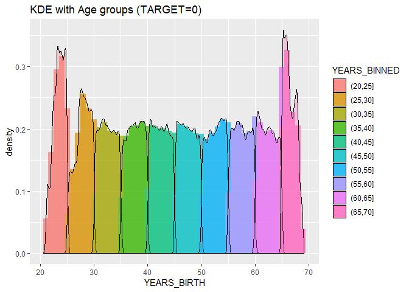
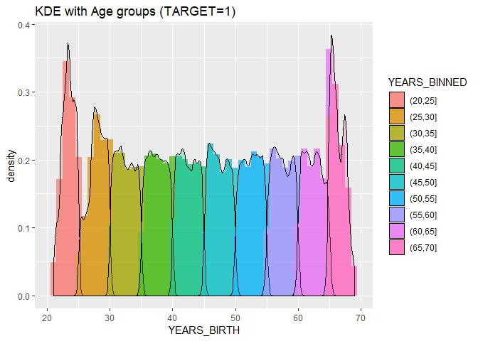
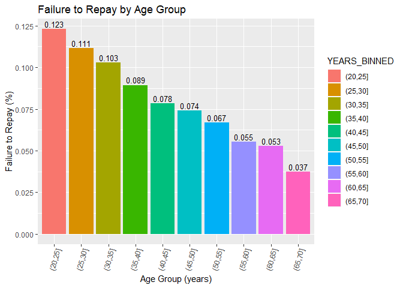

Day011
================

Kernel Density Estimation Introduction:
1. <https://blog.csdn.net/david830_wu/article/details/66974189>
2. <https://blog.csdn.net/unixtch/article/details/78556499>

Packages loading

``` r
library(magrittr)
library(purrr)
library(plyr)
library(tidyverse)
library(gridExtra)
```

Data loading

``` r
app_train <- read.csv("data/application_train.csv")
```

HW
--

1.  自 20 到 70 歲，切 11 個點，進行分群比較 (KDE plot)
2.  以年齡區間為 x, target 為 y 繪製 barplot

根據年齡分成不同組別 (年齡區間 - 還款與否)

``` r
app_train$DAYS_BIRTH <- abs(app_train$DAYS_BIRTH)

age_data <- app_train %>% select(c(TARGET, DAYS_BIRTH))
age_data$YEARS_BIRTH <- age_data$DAYS_BIRTH / 365
```

各組年齡數量

``` r
breaks <- seq(20, 70, length.out = 11)
age_data$YEARS_BINNED <- cut(age_data$YEARS_BIRTH, breaks = breaks)
table(age_data$YEARS_BINNED)
```

    ## 
    ## (20,25] (25,30] (30,35] (35,40] (40,45] (45,50] (50,55] (55,60] (60,65] 
    ##   12159   32862   39440   42868   41406   35135   34942   33120   27476 
    ## (65,70] 
    ##    8103

``` r
head(age_data)
```

    ##   TARGET DAYS_BIRTH YEARS_BIRTH YEARS_BINNED
    ## 1      1       9461    25.92055      (25,30]
    ## 2      0      16765    45.93151      (45,50]
    ## 3      0      19046    52.18082      (50,55]
    ## 4      0      19005    52.06849      (50,55]
    ## 5      0      19932    54.60822      (50,55]
    ## 6      0      16941    46.41370      (45,50]

KDE plot

``` r
age_data %>% 
  filter(TARGET == 0) %>% 
  mutate(TARGET = as.factor(TARGET)) %>%
  ggplot(aes(x = YEARS_BIRTH, fill = YEARS_BINNED)) +
    geom_histogram(aes(y = ..density..),binwidth = 1, alpha = .7, linetype = "blank") +
    geom_density(alpha = .3) +
    ggtitle("KDE with Age groups (TARGET=0)")
```



``` r
age_data %>% 
  filter(TARGET == 1) %>% 
  mutate(TARGET = as.factor(TARGET)) %>%
  ggplot(aes(x = YEARS_BIRTH, fill = YEARS_BINNED)) +
    geom_histogram(aes(y = ..density..),binwidth = 1, alpha = .7, linetype = "blank") +
    geom_density(alpha = .3) +
    ggtitle("KDE with Age groups (TARGET=1)")
```



計算每個年齡區間的 Target、DAYS\_BIRTH與 YEARS\_BIRTH 的平均值

``` r
(age_group_data <- age_data %>% 
   group_by(YEARS_BINNED) %>%
   dplyr::summarise(TARGET = mean(TARGET),
                    DAYS_BIRTH = mean(DAYS_BIRTH),
                    YEARS_BIRTH = mean(YEARS_BIRTH)))
```

    ## # A tibble: 10 x 4
    ##    YEARS_BINNED TARGET DAYS_BIRTH YEARS_BIRTH
    ##    <fct>         <dbl>      <dbl>       <dbl>
    ##  1 (20,25]      0.123       8533.        23.4
    ##  2 (25,30]      0.111      10155.        27.8
    ##  3 (30,35]      0.103      11855.        32.5
    ##  4 (35,40]      0.0894     13708.        37.6
    ##  5 (40,45]      0.0785     15498.        42.5
    ##  6 (45,50]      0.0742     17324.        47.5
    ##  7 (50,55]      0.0670     19196.        52.6
    ##  8 (55,60]      0.0553     20984.        57.5
    ##  9 (60,65]      0.0527     22781.        62.4
    ## 10 (65,70]      0.0373     24293.        66.6

以年齡區間為 x, target 為 y 繪製 barplot

``` r
ggplot(age_group_data, aes(x = YEARS_BINNED, y = TARGET, fill = YEARS_BINNED)) +
  geom_bar(stat = "identity") + 
  geom_text(aes(label=round(TARGET,3)), vjust=-0.3, size=3.5) +
  theme(axis.text.x = element_text(angle = 75, hjust = 1)) +
  labs(title = 'Failure to Repay by Age Group',
       x = 'Age Group (years)',
       y = 'Failure to Repay (%)')
```


