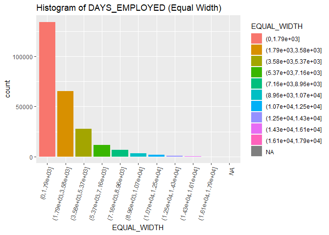
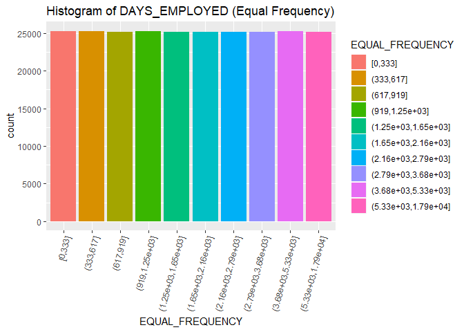

Day013
================

``` r
library(plyr)
library(tidyverse)
```

Data loading

``` r
app_train <- read.csv("data/application_train.csv")
app_test <- read.csv("data/application_train.csv")
```

Label encoding

``` r
feature.names <- colnames(app_train)
count <- 0

# Iterate through the columns
for (f in feature.names) {
    if (class(app_train[[f]]) == 'factor') {
        if (nlevels(app_train[[f]]) <= 2) {
        levels <- list(app_train[[f]], app_test[[f]]) %>% unlist() %>% levels()
        app_train[[f]] <- mapvalues(app_train[[f]], from=levels, to=c(1,2)) %>% as.integer()
        app_test[[f]] <- mapvalues(app_test[[f]], from=levels, to=c(1,2)) %>% as.integer()
        count <- count + 1
        }
    }
}

print(paste(count,"labels were label encoded."))
```

    ## [1] "3 labels were label encoded."

``` r
# Create an anomalous flag column
app_train$DAYS_EMPLOYED_ANOM <- app_train$DAYS_EMPLOYED == 365243
app_train$DAYS_EMPLOYED[which(app_train$DAYS_EMPLOYED == 365243)] <- NA

# also apply to testing dataset
app_test$DAYS_EMPLOYED_ANOM <- app_test$DAYS_EMPLOYED == 365243
app_test$DAYS_EMPLOYED[which(app_test$DAYS_EMPLOYED == 365243)] <- NA

# absolute the value of DAYS_BIRTH
app_train$DAYS_BIRTH <- abs(app_train$DAYS_BIRTH)
app_test$DAYS_BIRTH <- abs(app_test$DAYS_BIRTH)

# absolute the value of DAYS_EMPLOYED
app_train$DAYS_EMPLOYED <- abs(app_train$DAYS_EMPLOYED)
app_test$DAYS_EMPLOYED <- abs(app_test$DAYS_EMPLOYED)
```

離散化DAYS\_EMPLOYED
--------------------

等寬劃分

``` r
days_employed <- app_train$DAYS_EMPLOYED[!is.na(app_train$DAYS_EMPLOYED)]

breaks <- seq(min(days_employed), max(days_employed), length.out = 11)
EQUAL_WIDTH = cut(days_employed, breaks = breaks)
table(EQUAL_WIDTH)
```

    ## EQUAL_WIDTH
    ##        (0,1.79e+03] (1.79e+03,3.58e+03] (3.58e+03,5.37e+03] 
    ##              134390               65188               27932 
    ## (5.37e+03,7.16e+03] (7.16e+03,8.96e+03] (8.96e+03,1.07e+04] 
    ##               11382                6563                3387 
    ## (1.07e+04,1.25e+04] (1.25e+04,1.43e+04] (1.43e+04,1.61e+04] 
    ##                2027                 955                 261 
    ## (1.61e+04,1.79e+04] 
    ##                  50

等頻劃分

``` r
breaks <- quantile(days_employed, probs = 0:10/10)
breaks
```

    ##      0%     10%     20%     30%     40%     50%     60%     70%     80% 
    ##     0.0   333.0   617.0   919.0  1250.0  1648.0  2160.0  2792.0  3675.8 
    ##     90%    100% 
    ##  5333.0 17912.0

``` r
EQUAL_FREQUENCY = cut(days_employed, breaks = breaks, include.lowest=TRUE)
table(EQUAL_FREQUENCY)
```

    ## EQUAL_FREQUENCY
    ##             [0,333]           (333,617]           (617,919] 
    ##               25235               25276               25159 
    ##      (919,1.25e+03] (1.25e+03,1.65e+03] (1.65e+03,2.16e+03] 
    ##               25250               25204               25186 
    ## (2.16e+03,2.79e+03] (2.79e+03,3.68e+03] (3.68e+03,5.33e+03] 
    ##               25206               25193               25217 
    ## (5.33e+03,1.79e+04] 
    ##               25211

``` r
DAYS_EMPLOYED <- data.frame(DAYS_EMPLOYED = days_employed,
                            EQUAL_WIDTH = EQUAL_WIDTH,
                            EQUAL_FREQUENCY = EQUAL_FREQUENCY)
head(DAYS_EMPLOYED)
```

    ##   DAYS_EMPLOYED         EQUAL_WIDTH     EQUAL_FREQUENCY
    ## 1           637        (0,1.79e+03]           (617,919]
    ## 2          1188        (0,1.79e+03]      (919,1.25e+03]
    ## 3           225        (0,1.79e+03]             [0,333]
    ## 4          3039 (1.79e+03,3.58e+03] (2.79e+03,3.68e+03]
    ## 5          3038 (1.79e+03,3.58e+03] (2.79e+03,3.68e+03]
    ## 6          1588        (0,1.79e+03] (1.25e+03,1.65e+03]

``` r
ggplot(DAYS_EMPLOYED, aes(x = EQUAL_WIDTH, fill = EQUAL_WIDTH)) +
  geom_histogram(stat = "count") +
  theme(axis.text.x = element_text(angle = 75, hjust = 1)) +
  ggtitle("Histogram of DAYS_EMPLOYED (Equal Width)")
```



``` r
ggplot(DAYS_EMPLOYED, aes(x = EQUAL_FREQUENCY, fill = EQUAL_FREQUENCY)) +
  geom_histogram(stat = "count") +
  theme(axis.text.x = element_text(angle = 75, hjust = 1)) +
  ggtitle("Histogram of DAYS_EMPLOYED (Equal Frequency)")
```


