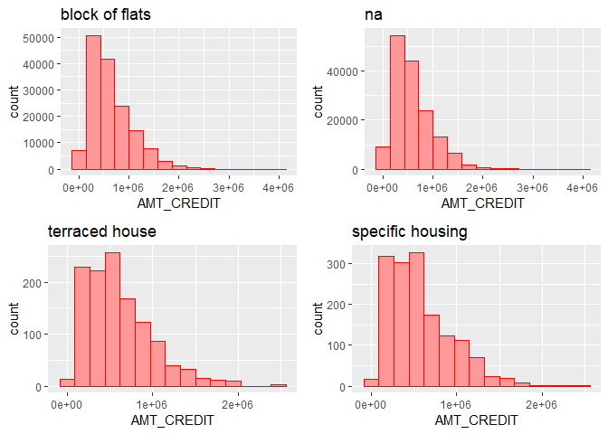
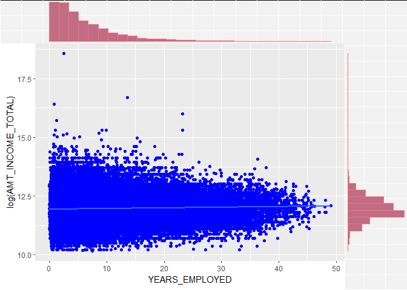

Day014
================

``` r
library(tidyverse)
library(plyr)
library(magrittr)
library(ggExtra)
library(gridExtra)
library(purrr)
```

Data loading

``` r
app_train <- read.csv("data/application_train.csv")
```

根據不同的 HOUSETYPE\_MODE 對 AMT\_CREDIT 繪製 Histogram
--------------------------------------------------------

Subset the data

``` r
house_type <- app_train %>% 
  select(HOUSETYPE_MODE, AMT_CREDIT)

house_type$HOUSETYPE_MODE <- mapvalues(house_type$HOUSETYPE_MODE, from = "", to = 'na')
head(house_type)
```

    ##   HOUSETYPE_MODE AMT_CREDIT
    ## 1 block of flats   406597.5
    ## 2 block of flats  1293502.5
    ## 3             na   135000.0
    ## 4             na   312682.5
    ## 5             na   513000.0
    ## 6             na   490495.5

``` r
unique_house_type <- unique(house_type$HOUSETYPE_MODE)

housetype_subplot <- function (type) {
   house_type %>% 
       filter(HOUSETYPE_MODE == type) %>%
       ggplot(aes(x = AMT_CREDIT)) +
         geom_histogram(bins = 15, fill = "#FF9999", color = "red") +
         ggtitle(type)
}

myplots <- lapply(unique_house_type, housetype_subplot)
do.call(grid.arrange, myplots)
```



log(AMT\_INCOME\_TOTAL) 對 YEARS\_EMPLOYED 繪製 Scatterplot
-----------------------------------------------------------

``` r
# Create an anomalous flag column
app_train$DAYS_EMPLOYED_ANOM <- app_train$DAYS_EMPLOYED == 365243
app_train$DAYS_EMPLOYED[which(app_train$DAYS_EMPLOYED == 365243)] <- NA

# absolute the value of DAYS_EMPLOYED
app_train$DAYS_EMPLOYED <- abs(app_train$DAYS_EMPLOYED)

app_train$YEARS_EMPLOYED <- app_train$DAYS_EMPLOYED / 365
```

``` r
a <- ggplot(app_train, aes(x = YEARS_EMPLOYED, y = log(AMT_INCOME_TOTAL))) +
  geom_point(colour = "blue") +
  stat_smooth(method = "lm", formula = y~x)

a <- ggMarginal(a, type="histogram",fill="#C06C84", color="#F67280")
plot(a)
```


