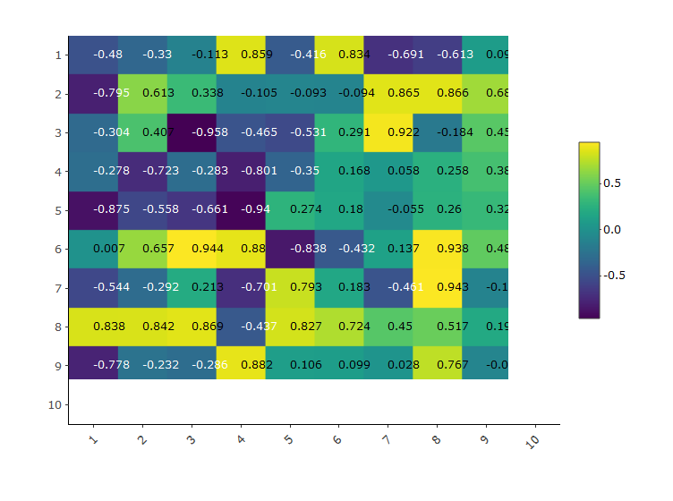
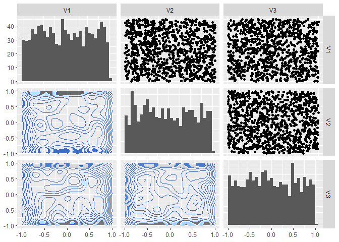
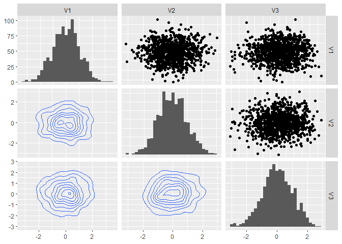

Day015
================

Introduction to GGally: <https://ggobi.github.io/ggally/#matrix_sections>

``` r
library(tidyverse)
library(heatmaply)
library(GGally)
```

建立一個 10 x 10, 數值分布自 -1.0 ~ 1.0 的矩陣並繪製 Heatmap
------------------------------------------------------------

``` r
mat1 <- matrix(runif(100, min = -1, max = 1), nrow = 10)
heatmaply(mat1, draw_cellnote = TRUE, dendrogram = "none")
```



建立一個 1000 x 3, 數值分布為 -1.0 ~ 1.0 的矩陣，並繪製 PairPlot (上半部為 scatter, 對角線為 hist, 下半部為 density)
--------------------------------------------------------------------------------------------------------------------

``` r
df1 <- matrix(runif(3000, min = -1, max = 1), nrow = 1000) %>% as.data.frame()
ggpairs(df1, 
        upper = list(continuous = 'points'),
        diag = list(continuous = 'barDiag'),
        lower = list(continuous = 'density'))
```

    ## `stat_bin()` using `bins = 30`. Pick better value with `binwidth`.
    ## `stat_bin()` using `bins = 30`. Pick better value with `binwidth`.
    ## `stat_bin()` using `bins = 30`. Pick better value with `binwidth`.



建立一個 1000 x 3, 數值分布為常態分佈的矩陣，並繪製 PairPlot (上半部為 scatter, 對角線為 hist, 下半部為 density)
----------------------------------------------------------------------------------------------------------------

``` r
df2 <- matrix(rnorm(3000, mean = 0, sd = 1), nrow = 1000) %>% as.data.frame()
ggpairs(df2, 
        upper = list(continuous = 'points'),
        diag = list(continuous = 'barDiag'),
        lower = list(continuous = 'density'))
```

    ## `stat_bin()` using `bins = 30`. Pick better value with `binwidth`.
    ## `stat_bin()` using `bins = 30`. Pick better value with `binwidth`.
    ## `stat_bin()` using `bins = 30`. Pick better value with `binwidth`.


