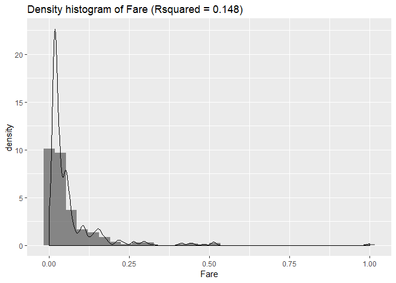
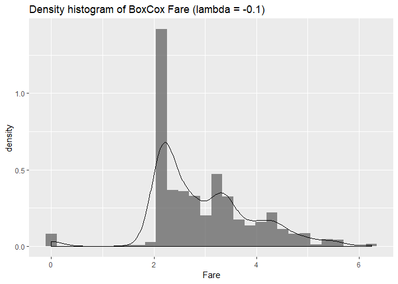

Day021
================

HW (Kaggle)鐵達尼生存預測精簡版
-------------------------------

<https://www.kaggle.com/c/titanic>

Packages loading

``` r
library(purrr)
library(plyr)
library(tidyverse)
library(caret)
library(ROCR)
```

Data loading

``` r
df_train <- read.csv("data/titanic_train.csv")
df_test <- read.csv("data/titanic_test.csv")
sapply(list(df_train=df_train, df_test=df_test), dim) %>% 'rownames<-'(c('nrow','ncol')) 
```

    ##      df_train df_test
    ## nrow      891     418
    ## ncol       12      11

Setting training and testing data

``` r
train_y <- df_train$Survived
ids <- df_test$PassengerId
df_train <- df_train %>% select(-c("Survived","PassengerId"))
df_test <- df_test %>% select(-"PassengerId")
df <- rbind(df_train, df_test)
head(df)
```

    ##   Pclass                                                Name    Sex Age
    ## 1      3                             Braund, Mr. Owen Harris   male  22
    ## 2      1 Cumings, Mrs. John Bradley (Florence Briggs Thayer) female  38
    ## 3      3                              Heikkinen, Miss. Laina female  26
    ## 4      1        Futrelle, Mrs. Jacques Heath (Lily May Peel) female  35
    ## 5      3                            Allen, Mr. William Henry   male  35
    ## 6      3                                    Moran, Mr. James   male  NA
    ##   SibSp Parch           Ticket    Fare Cabin Embarked
    ## 1     1     0        A/5 21171  7.2500              S
    ## 2     1     0         PC 17599 71.2833   C85        C
    ## 3     0     0 STON/O2. 3101282  7.9250              S
    ## 4     1     0           113803 53.1000  C123        S
    ## 5     0     0           373450  8.0500              S
    ## 6     0     0           330877  8.4583              Q

秀出資料欄位的類型與數量

``` r
table(sapply(df, class))
```

    ## 
    ##  factor integer numeric 
    ##       5       3       2

確定只有 integer, numeric, factor 三種類型後, 分別將欄位名稱存於三個 vector 中

``` r
feature_type <- sapply(df, class)
int_var <- feature_type[which(feature_type == "integer")] %>% as.data.frame %>% rownames
num_var <- feature_type[which(feature_type == "numeric")] %>% as.data.frame %>% rownames
fac_var <- feature_type[which(feature_type == "factor")] %>% as.data.frame %>% rownames
list(integer_feature = int_var,
     numeric_feature = num_var,
     factor_feature = fac_var)
```

    ## $integer_feature
    ## [1] "Pclass" "SibSp"  "Parch" 
    ## 
    ## $numeric_feature
    ## [1] "Age"  "Fare"
    ## 
    ## $factor_feature
    ## [1] "Name"     "Sex"      "Ticket"   "Cabin"    "Embarked"

削減文字型欄位, 只剩數值型欄位

``` r
df <- df %>% select(-fac_var)
train_num <- length(train_y)
head(df)
```

    ##   Pclass Age SibSp Parch    Fare
    ## 1      3  22     1     0  7.2500
    ## 2      1  38     1     0 71.2833
    ## 3      3  26     0     0  7.9250
    ## 4      1  35     1     0 53.1000
    ## 5      3  35     0     0  8.0500
    ## 6      3  NA     0     0  8.4583

作業1
-----

試著在鐵達尼的票價 (Fare) 欄位中使用對數去偏 (log1p) , 結果是否更好?

``` r
# 做線性迴歸, 觀察分數
df_m1 <- df %>% replace(., is.na(.), -1) # 缺失值補-1
train_x <- df_m1[1:train_num,] 
normal <- preProcess(train_x, method = "range", rangeBounds = c(0,1)) # 最小最大化
train_normal <- predict(normal, train_x)
train <- train_normal %>% mutate(Survived = train_y)
control <- trainControl(method="cv", number=5) # 交叉驗證, folds=5
fit <- train(Survived~., data=train, method="lm", metric="Rsquared", trControl=control)
# display results
print(fit)
```

    ## Linear Regression 
    ## 
    ## 891 samples
    ##   5 predictor
    ## 
    ## No pre-processing
    ## Resampling: Cross-Validated (5 fold) 
    ## Summary of sample sizes: 713, 713, 712, 713, 713 
    ## Resampling results:
    ## 
    ##   RMSE       Rsquared   MAE      
    ##   0.4521556  0.1481688  0.4070241
    ## 
    ## Tuning parameter 'intercept' was held constant at a value of TRUE

Density histogram of Fare

``` r
ggplot(train, aes(x = Fare)) +
    geom_histogram(aes(y = ..density..), alpha = .7, linetype = "blank") +
    geom_density(alpha = .3) +
    ggtitle(paste0("Density histogram of Fare"," (Rsquared = ",round(fit$results["Rsquared"],3),")"))
```

    ## `stat_bin()` using `bins = 30`. Pick better value with `binwidth`.



``` r
# 做線性迴歸, 觀察分數
df_m1 <- df %>% replace(., is.na(.), -1) # 缺失值補-1
train_x_fixed <- df_m1[1:train_num,] %>% mutate(log_Fare = log1p(train_x$Fare)) %>% select(-"Fare")
fixed_normal <- preProcess(train_x_fixed, method = "range", rangeBounds = c(0,1)) # 最小最大化
train_fixed_normal <- predict(fixed_normal, train_x_fixed)
train_fixed <- train_fixed_normal %>% mutate(Survived = train_y)
control <- trainControl(method="cv", number=5) # 交叉驗證, folds=5
fix_fit <- train(Survived~., data=train_fixed, method="lm", metric="Rsquared", trControl=control)
# display results
print(fix_fit)
```

    ## Linear Regression 
    ## 
    ## 891 samples
    ##   5 predictor
    ## 
    ## No pre-processing
    ## Resampling: Cross-Validated (5 fold) 
    ## Summary of sample sizes: 713, 712, 713, 713, 713 
    ## Resampling results:
    ## 
    ##   RMSE       Rsquared   MAE      
    ##   0.4481613  0.1584734  0.4005465
    ## 
    ## Tuning parameter 'intercept' was held constant at a value of TRUE

Density histogram of log1p(Fare)

``` r
ggplot(train_fixed, aes(x = log_Fare)) +
    geom_histogram(aes(y = ..density..), alpha = .7, linetype = "blank") +
    geom_density(alpha = .3) +
    ggtitle(paste0("Density histogram of Fare"," (Rsquared = ",round(fix_fit$results["Rsquared"],3),")"))
```

    ## `stat_bin()` using `bins = 30`. Pick better value with `binwidth`.


作業2
-----

最後的 boxcox 區塊直接執行會造成錯誤, 起因為輸入值有負值, 請問如何修正後可以使用 boxcox? (Hint : 試圖修正資料)

``` r
# 做線性迴歸, 觀察分數
train_x <- df[1:train_num,]
train_x$Fare <- train_x$Fare + 1 # Note that BoxCox is applied to positive values
myBoxCoxTrans <- BoxCoxTrans(train_x$Fare)
myBoxCoxTrans
```

    ## Box-Cox Transformation
    ## 
    ## 891 data points used to estimate Lambda
    ## 
    ## Input data summary:
    ##    Min. 1st Qu.  Median    Mean 3rd Qu.    Max. 
    ##    1.00    8.91   15.45   33.20   32.00  513.33 
    ## 
    ## Largest/Smallest: 513 
    ## Sample Skewness: 4.77 
    ## 
    ## Estimated Lambda: -0.1 
    ## With fudge factor, Lambda = 0 will be used for transformations

``` r
train_x$Fare <- predict(myBoxCoxTrans, train_x$Fare)

ggplot(train_x, aes(x = Fare)) +
    geom_histogram(aes(y = ..density..), alpha = .7, linetype = "blank") +
    geom_density(alpha = .3) +
    ggtitle(paste0('Density histogram of BoxCox Fare'," (lambda = ", round(myBoxCoxTrans$lambda,3), ")"))
```

    ## `stat_bin()` using `bins = 30`. Pick better value with `binwidth`.



``` r
train_x_m1 <- train_x %>% replace(., is.na(.), -1) # 缺失值補-1
normal <- preProcess(train_x_m1, method = "range", rangeBounds = c(0,1)) # 最小最大化
train_normal <- predict(normal, train_x_m1)
train <- train_normal %>% mutate(Survived = train_y)
control <- trainControl(method="cv", number=5) # 交叉驗證, folds=5
fit <- train(Survived~., data=train, method="lm", metric="Rsquared", trControl=control)
# display results
print(fit)
```

    ## Linear Regression 
    ## 
    ## 891 samples
    ##   5 predictor
    ## 
    ## No pre-processing
    ## Resampling: Cross-Validated (5 fold) 
    ## Summary of sample sizes: 713, 713, 712, 713, 713 
    ## Resampling results:
    ## 
    ##   RMSE       Rsquared   MAE      
    ##   0.4478235  0.1549885  0.3994386
    ## 
    ## Tuning parameter 'intercept' was held constant at a value of TRUE
