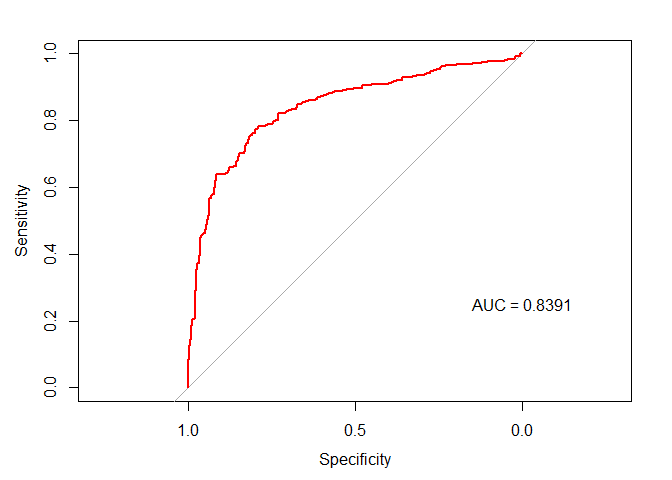
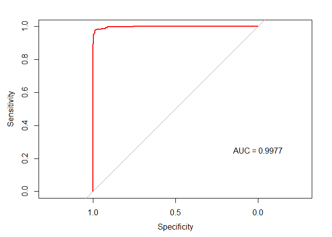

Day021
================

Visiting: Categorical Features and Encoding in Decision Trees:
<https://medium.com/data-design/visiting-categorical-features-and-encoding-in-decision-trees-53400fa65931>

HW (Kaggle)鐵達尼生存預測精簡版
-------------------------------

<https://www.kaggle.com/c/titanic>

Packages loading

``` r
library(purrr)
library(magrittr)
library(plyr)
library(tidyverse)
library(caret)
library(pROC)
```

Data loading

``` r
df_train <- read.csv("data/titanic_train.csv")
df_test <- read.csv("data/titanic_test.csv")
sapply(list(df_train=df_train, df_test=df_test), dim) %>% 'rownames<-'(c('nrow','ncol')) 
```

    ##      df_train df_test
    ## nrow      891     418
    ## ncol       12      11

Setting training and testing data

``` r
train_y <- df_train$Survived
ids <- df_test$PassengerId
df_train <- df_train %>% select(-c("Survived","PassengerId"))
df_test <- df_test %>% select(-"PassengerId")
df <- rbind(df_train, df_test)
```

秀出資料欄位的類型與數量

``` r
table(sapply(df, class))
```

    ## 
    ##  factor integer numeric 
    ##       5       3       2

確定只有 integer, numeric, factor 三種類型後, 分別將欄位名稱存於三個 vector 中

``` r
feature_type <- sapply(df, class)
int_var <- feature_type[which(feature_type == "integer")] %>% as.data.frame %>% rownames
num_var <- feature_type[which(feature_type == "numeric")] %>% as.data.frame %>% rownames
fac_var <- feature_type[which(feature_type == "factor")] %>% as.data.frame %>% rownames
list(integer_feature = int_var,
     numeric_feature = num_var,
     factor_feature = fac_var)
```

    ## $integer_feature
    ## [1] "Pclass" "SibSp"  "Parch" 
    ## 
    ## $numeric_feature
    ## [1] "Age"  "Fare"
    ## 
    ## $factor_feature
    ## [1] "Name"     "Sex"      "Ticket"   "Cabin"    "Embarked"

只留文字型欄位

``` r
df <- df %>% select(fac_var)
train_num <- length(train_y)

# Fill empty entry with None
feature.names <- colnames(df)
for (f in feature.names) {
  df[[f]] <- mapvalues(df[[f]], from="", to="None")
}
```

    ## The following `from` values were not present in `x`: 
    ## The following `from` values were not present in `x`: 
    ## The following `from` values were not present in `x`:

Label encoding

``` r
feature.names <- colnames(df)
count <- 0

df_le <- df
# Iterate through the columns
for (f in feature.names) {
  levels <- df[[f]] %>% unlist() %>% levels()
  df_le[[f]] <- mapvalues(df[[f]], from=levels, to=seq_along(levels)) %>% as.integer()
  count <- count + 1
}
```

Logistic Regression + Label encoding

``` r
train_le <- df_le[1:train_num,] %>% mutate(Survived = as.factor(train_y))
levels(train_le$Survived) <- make.names(levels(factor(train_le$Survived)))
control <- trainControl(method="cv", number=5, classProbs=TRUE, summaryFunction=twoClassSummary)
fit_le <- train(Survived~., data=train_le, method="glm", metric="ROC", trControl=control)
# display results
print(fit_le)
```

    ## Generalized Linear Model 
    ## 
    ## 891 samples
    ##   5 predictor
    ##   2 classes: 'X0', 'X1' 
    ## 
    ## No pre-processing
    ## Resampling: Cross-Validated (5 fold) 
    ## Summary of sample sizes: 713, 713, 713, 713, 712 
    ## Resampling results:
    ## 
    ##   ROC        Sens       Spec    
    ##   0.8360796  0.8269558  0.704561

``` r
glm.probs <- predict(fit_le, data = train_le$Survived, type = "prob")
glm.ROC <- roc(response = train_le$Survived,
               predictor = glm.probs$X1,
               levels = levels(train_le$Survived))
plot(glm.ROC, type="S", col="red"); text(x=0, y=.25, labels=paste("AUC =", round(glm.ROC$auc, 4)))
```



Mean encoding

``` r
train <- df_le[1:train_num,] %>% mutate(Survived = train_y)
 mean_encoding <- function(feature) {
 train %>%
  group_by(train[[feature]]) %>% 
  summarise(mean = mean(Survived)) %>%
  set_colnames(c(feature, paste0(feature, ".mean"))) %>%
  right_join(train) %>%
  select(paste0(feature, ".mean")) %>%
  return
}

train_mean <- data.frame()[1:nrow(train),] # Set a empty dataframe
for (feature in feature.names) {
  feature.mean <- mean_encoding(feature = feature)
  train_mean <- cbind(feature.mean, train_mean)
}
```

    ## Joining, by = "Name"

    ## Joining, by = "Sex"

    ## Joining, by = "Ticket"

    ## Joining, by = "Cabin"

    ## Joining, by = "Embarked"

``` r
train_mean %>% head
```

    ##      Embarked.mean Cabin.mean Ticket.mean  Sex.mean Name.mean
    ## NA       0.3369565  0.2998544         0.0 0.1889081         0
    ## NA.1     0.5535714  1.0000000         1.0 0.7420382         1
    ## NA.2     0.3369565  0.2998544         1.0 0.7420382         1
    ## NA.3     0.3369565  0.5000000         0.5 0.7420382         1
    ## NA.4     0.3369565  0.2998544         0.0 0.1889081         0
    ## NA.5     0.3896104  0.2998544         0.0 0.1889081         0

``` r
all.equal(train_mean$Name.mean, train$Survived)
```

    ## [1] TRUE

``` r
# Since all Names are unique, 
# the mean_encoding function returns the value equivalent to the target variable, Survived.
# So we remove the Name.mean variable
train_mean <- train_mean %>% select(-"Name.mean")
```

``` r
train_mean <- train_mean %>% mutate(Survived = as.factor(train_y))
levels(train_mean$Survived) <- make.names(levels(factor(train_mean$Survived)))
control <- trainControl(method="cv", number=5, classProbs=TRUE, summaryFunction=twoClassSummary)
fit_mean <- train(Survived~., data=train_mean, method="glm", metric="ROC", trControl=control)
# display results
print(fit_mean)
```

    ## Generalized Linear Model 
    ## 
    ## 891 samples
    ##   4 predictor
    ##   2 classes: 'X0', 'X1' 
    ## 
    ## No pre-processing
    ## Resampling: Cross-Validated (5 fold) 
    ## Summary of sample sizes: 713, 713, 713, 712, 713 
    ## Resampling results:
    ## 
    ##   ROC        Sens       Spec     
    ##   0.9977362  0.9818182  0.9736147

``` r
glm.probs <- predict(fit_mean, data = train_mean$Survived, type = "prob")
glm.ROC <- roc(response = train_mean$Survived,
               predictor = glm.probs$X1,
               levels = levels(train_mean$Survived))
plot(glm.ROC, type="S", col="red"); text(x=0, y=.25, labels=paste("AUC =", round(glm.ROC$auc, 4)))
```


