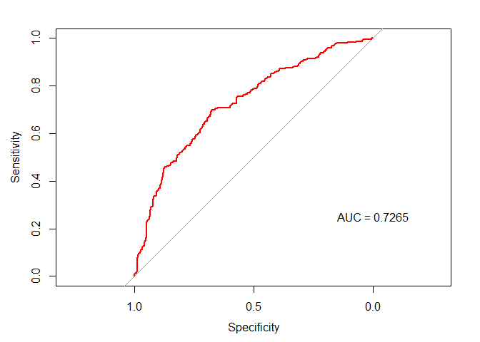
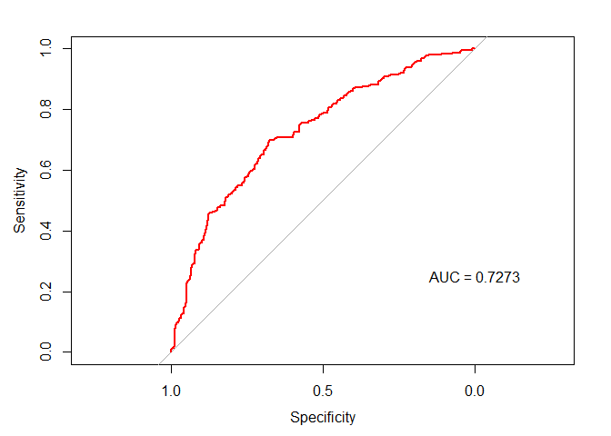

Day027
================

HW (Kaggle)鐵達尼生存預測精簡版
-------------------------------

<https://www.kaggle.com/c/titanic>

作業1
-----

試著使用鐵達尼號的例子，創立兩種以上的群聚編碼特徵( mean、median、mode、max、min、count 均可 )

Packages loading

``` r
library(purrr)
library(magrittr)
library(plyr)
library(tidyverse)
library(caret)
library(hash)
library(pROC)
```

Data loading

``` r
df_train <- read.csv("data/titanic_train.csv")
sapply(list(df_train=df_train), dim) %>% 'rownames<-'(c('nrow','ncol')) 
```

    ##      df_train
    ## nrow      891
    ## ncol       12

Setting training and testing data

``` r
train_y <- df_train$Survived
df <- df_train %>% select(-c("Survived","PassengerId"))
df %>% head
```

    ##   Pclass                                                Name    Sex Age
    ## 1      3                             Braund, Mr. Owen Harris   male  22
    ## 2      1 Cumings, Mrs. John Bradley (Florence Briggs Thayer) female  38
    ## 3      3                              Heikkinen, Miss. Laina female  26
    ## 4      1        Futrelle, Mrs. Jacques Heath (Lily May Peel) female  35
    ## 5      3                            Allen, Mr. William Henry   male  35
    ## 6      3                                    Moran, Mr. James   male  NA
    ##   SibSp Parch           Ticket    Fare Cabin Embarked
    ## 1     1     0        A/5 21171  7.2500              S
    ## 2     1     0         PC 17599 71.2833   C85        C
    ## 3     0     0 STON/O2. 3101282  7.9250              S
    ## 4     1     0           113803 53.1000  C123        S
    ## 5     0     0           373450  8.0500              S
    ## 6     0     0           330877  8.4583              Q

Fare對Ticket做群聚編碼

``` r
mean_df <- df %>%
  group_by(Ticket) %>%
  summarise(Fare_Mean = mean(Fare))

# 眾數function
value_most <- function(data) {
  data %>%
  table %>%
  which.max %>%
  names %>% 
  as.numeric
}

mode_df <- df %>%
  group_by(Ticket) %>%
  summarise(Fare_Mode = value_most(Fare))

median_df <- df %>%
  group_by(Ticket) %>%
  summarise(Fare_Median = median(Fare))

max_df <- df %>%
  group_by(Ticket) %>%
  summarise(Fare_Max = max(Fare))

temp <- df %>% 
  left_join(mean_df) %>%
  left_join(mode_df) %>%
  left_join(median_df) %>%
  left_join(max_df) %>%
  select(c("Ticket","Fare_Mean","Fare_Mode","Fare_Median","Fare_Max"))
```

    ## Joining, by = "Ticket"
    ## Joining, by = "Ticket"
    ## Joining, by = "Ticket"
    ## Joining, by = "Ticket"

``` r
temp %>% head
```

    ##             Ticket Fare_Mean Fare_Mode Fare_Median Fare_Max
    ## 1        A/5 21171    7.2500    7.2500      7.2500   7.2500
    ## 2         PC 17599   71.2833   71.2833     71.2833  71.2833
    ## 3 STON/O2. 3101282    7.9250    7.9250      7.9250   7.9250
    ## 4           113803   53.1000   53.1000     53.1000  53.1000
    ## 5           373450    8.0500    8.0500      8.0500   8.0500
    ## 6           330877    8.4583    8.4583      8.4583   8.4583

``` r
df <- df %>% 
  left_join(mean_df) %>%
  left_join(mode_df) %>%
  left_join(median_df) %>%
  left_join(max_df) %>%
  select(-Ticket)
```

    ## Joining, by = "Ticket"
    ## Joining, by = "Ticket"
    ## Joining, by = "Ticket"
    ## Joining, by = "Ticket"

``` r
df %>% head
```

    ##   Pclass                                                Name    Sex Age
    ## 1      3                             Braund, Mr. Owen Harris   male  22
    ## 2      1 Cumings, Mrs. John Bradley (Florence Briggs Thayer) female  38
    ## 3      3                              Heikkinen, Miss. Laina female  26
    ## 4      1        Futrelle, Mrs. Jacques Heath (Lily May Peel) female  35
    ## 5      3                            Allen, Mr. William Henry   male  35
    ## 6      3                                    Moran, Mr. James   male  NA
    ##   SibSp Parch    Fare Cabin Embarked Fare_Mean Fare_Mode Fare_Median
    ## 1     1     0  7.2500              S    7.2500    7.2500      7.2500
    ## 2     1     0 71.2833   C85        C   71.2833   71.2833     71.2833
    ## 3     0     0  7.9250              S    7.9250    7.9250      7.9250
    ## 4     1     0 53.1000  C123        S   53.1000   53.1000     53.1000
    ## 5     0     0  8.0500              S    8.0500    8.0500      8.0500
    ## 6     0     0  8.4583              Q    8.4583    8.4583      8.4583
    ##   Fare_Max
    ## 1   7.2500
    ## 2  71.2833
    ## 3   7.9250
    ## 4  53.1000
    ## 5   8.0500
    ## 6   8.4583

確定只有 integer, numeric, factor 三種類型後, 分別將欄位名稱存於三個 vector 中

``` r
feature_type <- sapply(df, class)
int_var <- feature_type[which(feature_type == "integer")] %>% as.data.frame %>% rownames
num_var <- feature_type[which(feature_type == "numeric")] %>% as.data.frame %>% rownames
fac_var <- feature_type[which(feature_type == "factor")] %>% as.data.frame %>% rownames
list(integer_feature = int_var,
     numeric_feature = num_var,
     factor_feature = fac_var)
```

    ## $integer_feature
    ## [1] "Pclass" "SibSp"  "Parch" 
    ## 
    ## $numeric_feature
    ## [1] "Age"         "Fare"        "Fare_Mean"   "Fare_Mode"   "Fare_Median"
    ## [6] "Fare_Max"   
    ## 
    ## $factor_feature
    ## [1] "Name"     "Sex"      "Cabin"    "Embarked"

只留數值型欄位

``` r
df <- df %>% select(-fac_var)

# 空值補 -1
df <- df %>% replace(., is.na(.), -1)
df %>% head
```

    ##   Pclass Age SibSp Parch    Fare Fare_Mean Fare_Mode Fare_Median Fare_Max
    ## 1      3  22     1     0  7.2500    7.2500    7.2500      7.2500   7.2500
    ## 2      1  38     1     0 71.2833   71.2833   71.2833     71.2833  71.2833
    ## 3      3  26     0     0  7.9250    7.9250    7.9250      7.9250   7.9250
    ## 4      1  35     1     0 53.1000   53.1000   53.1000     53.1000  53.1000
    ## 5      3  35     0     0  8.0500    8.0500    8.0500      8.0500   8.0500
    ## 6      3  -1     0     0  8.4583    8.4583    8.4583      8.4583   8.4583

作業2
-----

將上述的新特徵，合併原有的欄位做生存率預估，結果是否有改善?

``` r
# 沒有這四個新特徵的 dataframe 稱為 df_minus
df_minus <- df %>%
  select(-c('Fare_Mean', 'Fare_Mode', 'Fare_Median', 'Fare_Max'))
```

原始特徵 + 邏輯斯迴歸

``` r
train <- df_minus %>% mutate(Survived = as.factor(train_y))
levels(train$Survived) <- make.names(levels(factor(train$Survived)))
control <- trainControl(method="cv", number=5, classProbs=TRUE, summaryFunction=twoClassSummary)
fit <- train(Survived~., data=train, method="glm", metric="ROC", trControl=control)
# display results
print(fit)
```

    ## Generalized Linear Model 
    ## 
    ## 891 samples
    ##   5 predictor
    ##   2 classes: 'X0', 'X1' 
    ## 
    ## No pre-processing
    ## Resampling: Cross-Validated (5 fold) 
    ## Summary of sample sizes: 714, 713, 713, 712, 712 
    ## Resampling results:
    ## 
    ##   ROC        Sens       Spec    
    ##   0.7232902  0.8506088  0.450341

``` r
glm.probs <- predict(fit, data = train$Survived, type = "prob")
glm.ROC <- roc(response = train$Survived,
               predictor = glm.probs$X1,
               levels = levels(train$Survived))
plot(glm.ROC, type="S", col="red"); text(x=0, y=.25, labels=paste("AUC =", round(glm.ROC$auc, 4)))
```



新特徵 + 邏輯斯迴歸

``` r
train <- df %>% mutate(Survived = as.factor(train_y))
levels(train$Survived) <- make.names(levels(factor(train$Survived)))
control <- trainControl(method="cv", number=5, classProbs=TRUE, summaryFunction=twoClassSummary)
fit <- train(Survived~., data=train, method="glm", metric="ROC", trControl=control)
# display results
print(fit)
```

    ## Generalized Linear Model 
    ## 
    ## 891 samples
    ##   9 predictor
    ##   2 classes: 'X0', 'X1' 
    ## 
    ## No pre-processing
    ## Resampling: Cross-Validated (5 fold) 
    ## Summary of sample sizes: 712, 713, 714, 713, 712 
    ## Resampling results:
    ## 
    ##   ROC        Sens       Spec     
    ##   0.7162392  0.8488741  0.4621057

``` r
glm.probs <- predict(fit, data = train$Survived, type = "prob")
glm.ROC <- roc(response = train$Survived,
               predictor = glm.probs$X1,
               levels = levels(train$Survived))
plot(glm.ROC, type="S", col="red"); text(x=0, y=.25, labels=paste("AUC =", round(glm.ROC$auc, 4)))
```



``` r
# 結果: 準確度稍微上升
```
