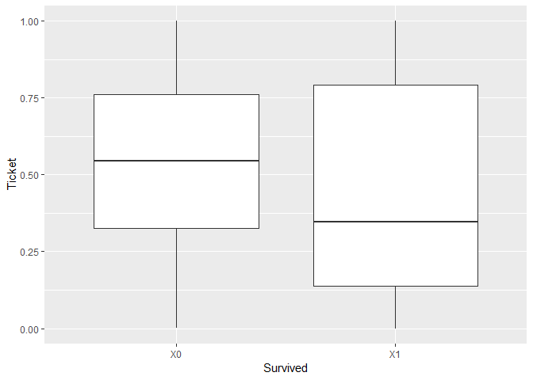
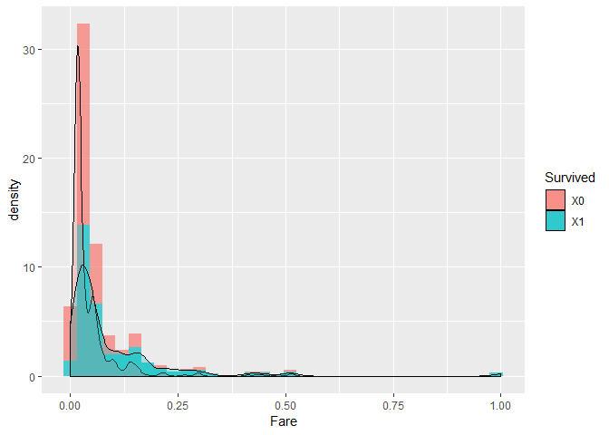

Day027
================

HW (Kaggle)鐵達尼生存預測精簡版
-------------------------------

<https://www.kaggle.com/c/titanic>

Packages loading

``` r
library(plyr)
library(tidyverse)
library(caret)
library(gbm)
library(mlbench)
```

Data loading

``` r
df_train <- read.csv("data/titanic_train.csv")
sapply(list(df_train=df_train), dim) %>% 'rownames<-'(c('nrow','ncol')) 
```

    ##      df_train
    ## nrow      891
    ## ncol       12

Setting training data

``` r
train_y <- df_train$Survived
df <- df_train %>% select(-c("Survived","PassengerId"))
df %>% head
```

    ##   Pclass                                                Name    Sex Age
    ## 1      3                             Braund, Mr. Owen Harris   male  22
    ## 2      1 Cumings, Mrs. John Bradley (Florence Briggs Thayer) female  38
    ## 3      3                              Heikkinen, Miss. Laina female  26
    ## 4      1        Futrelle, Mrs. Jacques Heath (Lily May Peel) female  35
    ## 5      3                            Allen, Mr. William Henry   male  35
    ## 6      3                                    Moran, Mr. James   male  NA
    ##   SibSp Parch           Ticket    Fare Cabin Embarked
    ## 1     1     0        A/5 21171  7.2500              S
    ## 2     1     0         PC 17599 71.2833   C85        C
    ## 3     0     0 STON/O2. 3101282  7.9250              S
    ## 4     1     0           113803 53.1000  C123        S
    ## 5     0     0           373450  8.0500              S
    ## 6     0     0           330877  8.4583              Q

秀出資料欄位的類型與數量

``` r
table(sapply(df, class))
```

    ## 
    ##  factor integer numeric 
    ##       5       3       2

確定只有 integer, numeric, factor 三種類型後, 分別將欄位名稱存於三個 vector 中

``` r
feature_type <- sapply(df, class)
int_var <- feature_type[which(feature_type == "integer")] %>% as.data.frame %>% rownames
num_var <- feature_type[which(feature_type == "numeric")] %>% as.data.frame %>% rownames
fac_var <- feature_type[which(feature_type == "factor")] %>% as.data.frame %>% rownames
list(integer_feature = int_var,
     numeric_feature = num_var,
     factor_feature = fac_var)
```

    ## $integer_feature
    ## [1] "Pclass" "SibSp"  "Parch" 
    ## 
    ## $numeric_feature
    ## [1] "Age"  "Fare"
    ## 
    ## $factor_feature
    ## [1] "Name"     "Sex"      "Ticket"   "Cabin"    "Embarked"

把類別型特徵做標籤編碼

``` r
feature.names <- colnames(df[fac_var])
count <- 0

# Iterate through the columns
for (f in feature.names) {
  levels <- df[[f]] %>% unlist() %>% levels()
  df[[f]] <- mapvalues(df[[f]], from=levels, to=seq_along(levels)) %>% as.integer()
  count <- count + 1
}
df %>% head
```

    ##   Pclass Name Sex Age SibSp Parch Ticket    Fare Cabin Embarked
    ## 1      3  109   2  22     1     0    524  7.2500     1        4
    ## 2      1  191   1  38     1     0    597 71.2833    83        2
    ## 3      3  358   1  26     0     0    670  7.9250     1        4
    ## 4      1  277   1  35     1     0     50 53.1000    57        4
    ## 5      3   16   2  35     0     0    473  8.0500     1        4
    ## 6      3  559   2  NA     0     0    276  8.4583     1        3

``` r
# 缺失值補-1
df <- df %>% replace(., is.na(.), -1)

# 最小最大化
normal <- preProcess(df, method = "range", rangeBounds = c(0,1))
train_X <- predict(normal, df)

train_X %>% head
```

    ##   Pclass       Name Sex       Age SibSp Parch     Ticket       Fare
    ## 1      1 0.12134831   1 0.2839506 0.125     0 0.76911765 0.01415106
    ## 2      0 0.21348315   0 0.4814815 0.125     0 0.87647059 0.13913574
    ## 3      1 0.40112360   0 0.3333333 0.000     0 0.98382353 0.01546857
    ## 4      0 0.31011236   0 0.4444444 0.125     0 0.07205882 0.10364430
    ## 5      1 0.01685393   1 0.4444444 0.000     0 0.69411765 0.01571255
    ## 6      1 0.62696629   1 0.0000000 0.000     0 0.40441176 0.01650950
    ##       Cabin  Embarked
    ## 1 0.0000000 1.0000000
    ## 2 0.5578231 0.3333333
    ## 3 0.0000000 1.0000000
    ## 4 0.3809524 1.0000000
    ## 5 0.0000000 1.0000000
    ## 6 0.0000000 0.6666667

梯度提升樹擬合後, 將結果依照重要性由高到低排序

``` r
train <- train_X %>% mutate(Survived = as.factor(train_y))
levels(train$Survived) <- make.names(levels(factor(train$Survived)))
control <- trainControl(method="cv", number=5, repeats=5)
gbm.fit <- train(Survived~., data=train, method="gbm", trControl=control, verbose = FALSE)
varImp(gbm.fit)
```

    ## gbm variable importance
    ## 
    ##           Overall
    ## Sex      100.0000
    ## Ticket    48.2834
    ## Name      28.2553
    ## Pclass    23.6941
    ## Fare      22.3892
    ## Cabin     18.9814
    ## Age       18.9355
    ## SibSp      0.5026
    ## Embarked   0.0378
    ## Parch      0.0000

``` r
# 保留特徵重要性較高的一半特徵
gbm_var <- varImp(gbm.fit)$importance %>%
  as.data.frame %>%
  rownames_to_column %>%
  arrange(desc(Overall)) %>%
  head(5) %>%
  {.$rowname}
```

原始特徵 + 梯度提升樹

``` r
train <- train_X %>% mutate(Survived = as.factor(train_y))
levels(train$Survived) <- make.names(levels(factor(train$Survived)))
control <- trainControl(method="cv", number=5, repeats=5)
gbm.fit <- train(Survived~., data=train, method="gbm", trControl=control, verbose = FALSE)
# display results
print(gbm.fit)
```

    ## Stochastic Gradient Boosting 
    ## 
    ## 891 samples
    ##  10 predictor
    ##   2 classes: 'X0', 'X1' 
    ## 
    ## No pre-processing
    ## Resampling: Cross-Validated (5 fold) 
    ## Summary of sample sizes: 712, 713, 713, 713, 713 
    ## Resampling results across tuning parameters:
    ## 
    ##   interaction.depth  n.trees  Accuracy   Kappa    
    ##   1                   50      0.7956688  0.5612436
    ##   1                  100      0.8023916  0.5756867
    ##   1                  150      0.8035152  0.5765843
    ##   2                   50      0.8069236  0.5788514
    ##   2                  100      0.8136275  0.5986644
    ##   2                  150      0.8192392  0.6106938
    ##   3                   50      0.8080535  0.5821726
    ##   3                  100      0.8159061  0.6020698
    ##   3                  150      0.8237775  0.6203904
    ## 
    ## Tuning parameter 'shrinkage' was held constant at a value of 0.1
    ## 
    ## Tuning parameter 'n.minobsinnode' was held constant at a value of 10
    ## Accuracy was used to select the optimal model using the largest value.
    ## The final values used for the model were n.trees = 150,
    ##  interaction.depth = 3, shrinkage = 0.1 and n.minobsinnode = 10.

高重要性特徵 + 梯度提升樹

``` r
train <- train_X[gbm_var] %>% mutate(Survived = as.factor(train_y))
levels(train$Survived) <- make.names(levels(factor(train$Survived)))
control <- trainControl(method="cv", number=5, repeats=5)
gbm.fit <- train(Survived~., data=train, method="gbm", trControl=control, verbose = FALSE)
# display results
print(gbm.fit)
```

    ## Stochastic Gradient Boosting 
    ## 
    ## 891 samples
    ##   5 predictor
    ##   2 classes: 'X0', 'X1' 
    ## 
    ## No pre-processing
    ## Resampling: Cross-Validated (5 fold) 
    ## Summary of sample sizes: 714, 713, 713, 712, 712 
    ## Resampling results across tuning parameters:
    ## 
    ##   interaction.depth  n.trees  Accuracy   Kappa    
    ##   1                   50      0.7845368  0.5377808
    ##   1                  100      0.7924021  0.5524675
    ##   1                  150      0.7980201  0.5627554
    ##   2                   50      0.7879139  0.5326314
    ##   2                  100      0.8024769  0.5700475
    ##   2                  150      0.8046863  0.5751073
    ##   3                   50      0.8047052  0.5707030
    ##   3                  100      0.8103234  0.5862738
    ##   3                  150      0.8137257  0.5938394
    ## 
    ## Tuning parameter 'shrinkage' was held constant at a value of 0.1
    ## 
    ## Tuning parameter 'n.minobsinnode' was held constant at a value of 10
    ## Accuracy was used to select the optimal model using the largest value.
    ## The final values used for the model were n.trees = 150,
    ##  interaction.depth = 3, shrinkage = 0.1 and n.minobsinnode = 10.

``` r
# 結果 : 準確度稍微下降
```

作業2
-----

將特徵重要性高的兩個特徵做特徵組合，是否能再進一步提升預測力?

``` r
ggplot(train, aes(x=Survived, y=Ticket)) +
  geom_boxplot()
```



``` r
train %>%
ggplot(aes(x = Fare, fill = Survived)) +
    geom_histogram(aes(y = ..density..),binwidth = .03, alpha = .7, linetype = "blank") +
    geom_density(alpha = .3)
```



作新特徵看效果

``` r
df$Add_char <- df$Sex + df$Fare
df$Multi_char <- df$Sex * df$Fare
df$GO_div1p <- df$Sex / (df$Fare + 1)
df$OG_div1p <- df$Fare / (df$Sex + 1)
dim(df)
```

    ## [1] 891  14

``` r
# 最小最大化
normal <- preProcess(df, method = "range", rangeBounds = c(0,1))
train_X <- predict(normal, df)
```

新特徵 + 梯度提升樹

``` r
train <- train_X %>% mutate(Survived = as.factor(train_y))
levels(train$Survived) <- make.names(levels(factor(train$Survived)))
control <- trainControl(method="cv", number=5, repeats=5)
gbm.fit <- train(Survived~., data=train, method="gbm", trControl=control, verbose = FALSE)
# display results
print(gbm.fit)
```

    ## Stochastic Gradient Boosting 
    ## 
    ## 891 samples
    ##  14 predictor
    ##   2 classes: 'X0', 'X1' 
    ## 
    ## No pre-processing
    ## Resampling: Cross-Validated (5 fold) 
    ## Summary of sample sizes: 713, 713, 714, 712, 712 
    ## Resampling results across tuning parameters:
    ## 
    ##   interaction.depth  n.trees  Accuracy   Kappa    
    ##   1                   50      0.7911777  0.5526200
    ##   1                  100      0.8024014  0.5735159
    ##   1                  150      0.8080321  0.5889914
    ##   2                   50      0.8091620  0.5842678
    ##   2                  100      0.8181258  0.6060044
    ##   2                  150      0.8214903  0.6135030
    ##   3                   50      0.8080257  0.5826974
    ##   3                  100      0.8158911  0.5993473
    ##   3                  150      0.8215155  0.6123178
    ## 
    ## Tuning parameter 'shrinkage' was held constant at a value of 0.1
    ## 
    ## Tuning parameter 'n.minobsinnode' was held constant at a value of 10
    ## Accuracy was used to select the optimal model using the largest value.
    ## The final values used for the model were n.trees = 150,
    ##  interaction.depth = 3, shrinkage = 0.1 and n.minobsinnode = 10.
