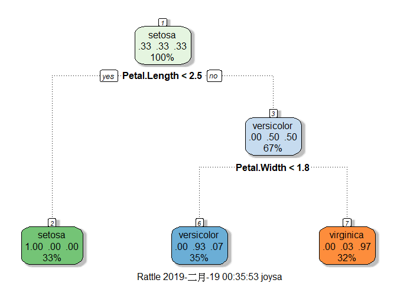
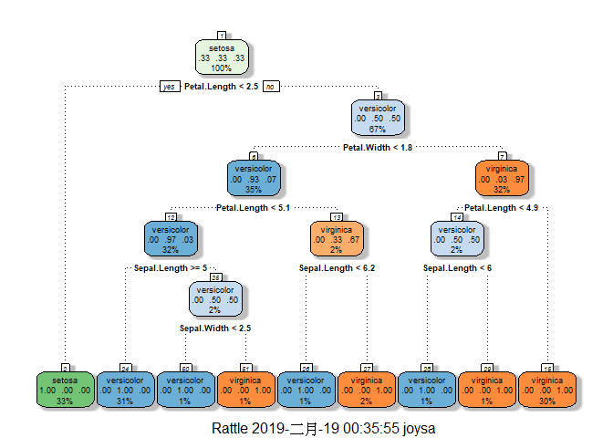
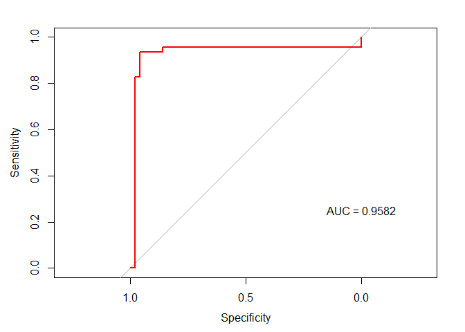
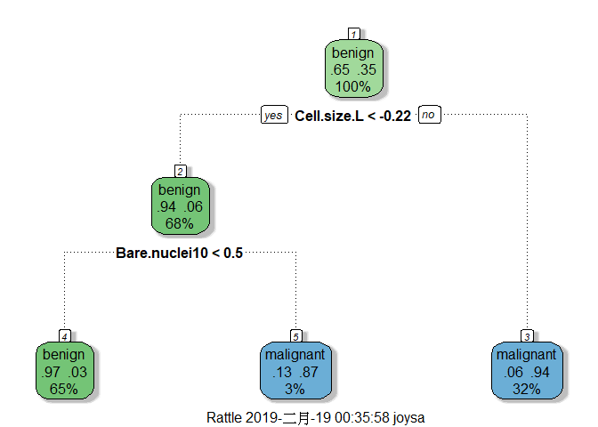

Day042
================

Packages loading

``` r
library(plyr)
library(tidyverse)
library(caret)
library(mlbench)
library(rpart)
library(pROC)
```

讀取鳶尾花資料集

``` r
str(iris)
```

    ## 'data.frame':    150 obs. of  5 variables:
    ##  $ Sepal.Length: num  5.1 4.9 4.7 4.6 5 5.4 4.6 5 4.4 4.9 ...
    ##  $ Sepal.Width : num  3.5 3 3.2 3.1 3.6 3.9 3.4 3.4 2.9 3.1 ...
    ##  $ Petal.Length: num  1.4 1.4 1.3 1.5 1.4 1.7 1.4 1.5 1.4 1.5 ...
    ##  $ Petal.Width : num  0.2 0.2 0.2 0.2 0.2 0.4 0.3 0.2 0.2 0.1 ...
    ##  $ Species     : Factor w/ 3 levels "setosa","versicolor",..: 1 1 1 1 1 1 1 1 1 1 ...

切分訓練集/測試集

``` r
intrain <- createDataPartition(iris$Species, p=.8, list=FALSE)
train <- iris[intrain,]; test <- iris[-intrain,]
```

``` r
control <- trainControl(method = "cv")
# fit the model
rpart_model = train(Species ~ ., data=train, method="rpart", trControl = control)
rpart_model
```

    ## CART 
    ## 
    ## 120 samples
    ##   4 predictor
    ##   3 classes: 'setosa', 'versicolor', 'virginica' 
    ## 
    ## No pre-processing
    ## Resampling: Cross-Validated (10 fold) 
    ## Summary of sample sizes: 108, 108, 108, 108, 108, 108, ... 
    ## Resampling results across tuning parameters:
    ## 
    ##   cp    Accuracy   Kappa 
    ##   0.00  0.9500000  0.9250
    ##   0.45  0.7250000  0.5875
    ##   0.50  0.3333333  0.0000
    ## 
    ## Accuracy was used to select the optimal model using the largest value.
    ## The final value used for the model was cp = 0.

``` r
varImp(rpart_model)
```

    ## rpart variable importance
    ## 
    ##              Overall
    ## Petal.Width   100.00
    ## Petal.Length   96.69
    ## Sepal.Length   40.45
    ## Sepal.Width     0.00

``` r
suppressMessages(library(rattle))

fancyRpartPlot(rpart_model$finalModel)
```



``` r
rpart.pred = predict(rpart_model, newdata = test)
table(rpart.pred, test$Species)
```

    ##             
    ## rpart.pred   setosa versicolor virginica
    ##   setosa         10          0         0
    ##   versicolor      0         10         2
    ##   virginica       0          0         8

``` r
(error.rate = round(mean(rpart.pred != test$Species),2))
```

    ## [1] 0.07

作業
----

1.  試著調整 DecisionTreeClassifier(...) 中的參數，並觀察是否會改變結果？

``` r
# minsplit：每一個node最少要幾個data
# minbucket：在末端的node上最少要幾個data
# cp：complexity parameter. (決定精度的參數)
# maxdepth：Tree的深度
control <- rpart.control(minsplit = 2, minbucket = 1)
# fit the model
rpart_model = train(Species ~ ., data=train, method="rpart", control=control)
rpart_model
```

    ## CART 
    ## 
    ## 120 samples
    ##   4 predictor
    ##   3 classes: 'setosa', 'versicolor', 'virginica' 
    ## 
    ## No pre-processing
    ## Resampling: Bootstrapped (25 reps) 
    ## Summary of sample sizes: 120, 120, 120, 120, 120, 120, ... 
    ## Resampling results across tuning parameters:
    ## 
    ##   cp    Accuracy   Kappa    
    ##   0.00  0.9447463  0.9160264
    ##   0.45  0.7203994  0.5919242
    ##   0.50  0.5371398  0.3274780
    ## 
    ## Accuracy was used to select the optimal model using the largest value.
    ## The final value used for the model was cp = 0.

``` r
fancyRpartPlot(rpart_model$finalModel)
```



``` r
rpart.pred = predict(rpart_model, newdata = test)
table(rpart.pred, test$Species)
```

    ##             
    ## rpart.pred   setosa versicolor virginica
    ##   setosa         10          0         0
    ##   versicolor      0         10         2
    ##   virginica       0          0         8

``` r
(error.rate = round(mean(rpart.pred != test$Species),2))
```

    ## [1] 0.07

1.  改用其他資料集 (boston, wine)，並與回歸模型的結果進行比較

``` r
data("BreastCancer")
str(BreastCancer)
```

    ## 'data.frame':    699 obs. of  11 variables:
    ##  $ Id             : chr  "1000025" "1002945" "1015425" "1016277" ...
    ##  $ Cl.thickness   : Ord.factor w/ 10 levels "1"<"2"<"3"<"4"<..: 5 5 3 6 4 8 1 2 2 4 ...
    ##  $ Cell.size      : Ord.factor w/ 10 levels "1"<"2"<"3"<"4"<..: 1 4 1 8 1 10 1 1 1 2 ...
    ##  $ Cell.shape     : Ord.factor w/ 10 levels "1"<"2"<"3"<"4"<..: 1 4 1 8 1 10 1 2 1 1 ...
    ##  $ Marg.adhesion  : Ord.factor w/ 10 levels "1"<"2"<"3"<"4"<..: 1 5 1 1 3 8 1 1 1 1 ...
    ##  $ Epith.c.size   : Ord.factor w/ 10 levels "1"<"2"<"3"<"4"<..: 2 7 2 3 2 7 2 2 2 2 ...
    ##  $ Bare.nuclei    : Factor w/ 10 levels "1","2","3","4",..: 1 10 2 4 1 10 10 1 1 1 ...
    ##  $ Bl.cromatin    : Factor w/ 10 levels "1","2","3","4",..: 3 3 3 3 3 9 3 3 1 2 ...
    ##  $ Normal.nucleoli: Factor w/ 10 levels "1","2","3","4",..: 1 2 1 7 1 7 1 1 1 1 ...
    ##  $ Mitoses        : Factor w/ 9 levels "1","2","3","4",..: 1 1 1 1 1 1 1 1 5 1 ...
    ##  $ Class          : Factor w/ 2 levels "benign","malignant": 1 1 1 1 1 2 1 1 1 1 ...

``` r
BreastCancer <- BreastCancer %>% select(-Id)
intrain <- sample(nrow(BreastCancer), nrow(BreastCancer)*.8)
train <- BreastCancer[intrain,]; test <- BreastCancer[-intrain,]


control <- trainControl(method="cv", number=5, classProbs = TRUE, summaryFunction=twoClassSummary)
glm_model <- train(Class~., data=train, method="glm", family="binomial", metric="ROC", trControl=control, na.action=na.pass)
glm_model
```

    ## Generalized Linear Model 
    ## 
    ## 559 samples
    ##   9 predictor
    ##   2 classes: 'benign', 'malignant' 
    ## 
    ## No pre-processing
    ## Resampling: Cross-Validated (5 fold) 
    ## Summary of sample sizes: 448, 447, 447, 447, 447 
    ## Resampling results:
    ## 
    ##   ROC        Sens       Spec     
    ##   0.9109633  0.9630786  0.8443995

``` r
glm_pred_prob <- predict(glm_model, test, type = 'prob',na.action=na.pass)
glm.ROC <- roc(response = test$Class,
               predictor = glm_pred_prob$benign,
               levels = levels(test$Class))
plot(glm.ROC, type="S", col="red"); text(x=0, y=.25, labels=paste("AUC =", round(glm.ROC$auc, 4)))
```



``` r
control <- trainControl(method = "cv")
# fit the model
rpart_model = train(Class ~ ., data=train, method="rpart", trControl = control, na.action=na.pass)
rpart_model
```

    ## CART 
    ## 
    ## 559 samples
    ##   9 predictor
    ##   2 classes: 'benign', 'malignant' 
    ## 
    ## No pre-processing
    ## Resampling: Cross-Validated (10 fold) 
    ## Summary of sample sizes: 502, 504, 503, 502, 503, 504, ... 
    ## Resampling results across tuning parameters:
    ## 
    ##   cp          Accuracy   Kappa    
    ##   0.01025641  0.9569771  0.9056072
    ##   0.05641026  0.9425917  0.8715775
    ##   0.82564103  0.8132986  0.4904756
    ## 
    ## Accuracy was used to select the optimal model using the largest value.
    ## The final value used for the model was cp = 0.01025641.

``` r
varImp(rpart_model)
```

    ## rpart variable importance
    ## 
    ##   only 20 most important variables shown (out of 80)
    ## 
    ##                   Overall
    ## Cell.size.L       100.000
    ## Cell.shape.L       98.876
    ## Epith.c.size.L     91.000
    ## Cell.size.C        82.979
    ## Cell.size.Q        82.979
    ## Bare.nuclei10      10.567
    ## Cl.thickness.L      8.914
    ## Epith.c.size.Q      5.921
    ## `Cl.thickness^4`    0.000
    ## `Cell.size^8`       0.000
    ## Normal.nucleoli5    0.000
    ## Mitoses2            0.000
    ## `Marg.adhesion^6`   0.000
    ## Bl.cromatin6        0.000
    ## Marg.adhesion.L     0.000
    ## `Cell.shape^6`      0.000
    ## `Cell.shape^9`      0.000
    ## Bare.nuclei9        0.000
    ## `Cl.thickness^5`    0.000
    ## `Cell.size^7`       0.000

``` r
suppressMessages(library(rattle))

fancyRpartPlot(rpart_model$finalModel)
```


