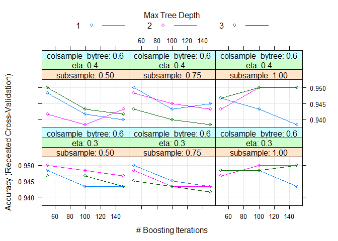
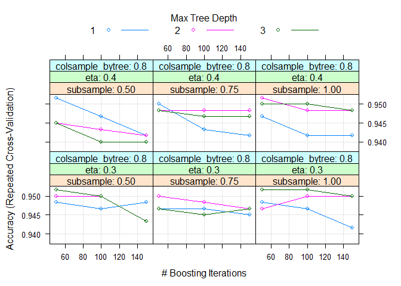
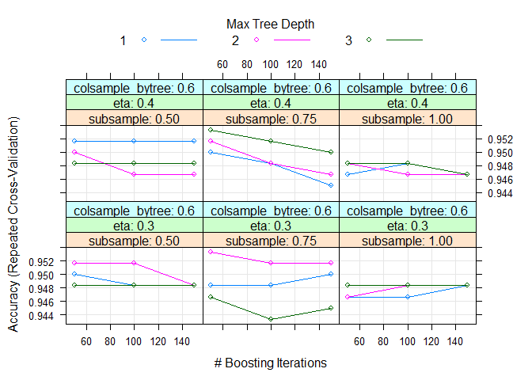

Day046
================

Packages loading

``` r
library(tidyverse)
library(caret)
library(xgboost)
```

讀取鳶尾花資料集

``` r
str(iris)
```

    ## 'data.frame':    150 obs. of  5 variables:
    ##  $ Sepal.Length: num  5.1 4.9 4.7 4.6 5 5.4 4.6 5 4.4 4.9 ...
    ##  $ Sepal.Width : num  3.5 3 3.2 3.1 3.6 3.9 3.4 3.4 2.9 3.1 ...
    ##  $ Petal.Length: num  1.4 1.4 1.3 1.5 1.4 1.7 1.4 1.5 1.4 1.5 ...
    ##  $ Petal.Width : num  0.2 0.2 0.2 0.2 0.2 0.4 0.3 0.2 0.2 0.1 ...
    ##  $ Species     : Factor w/ 3 levels "setosa","versicolor",..: 1 1 1 1 1 1 1 1 1 1 ...

切分訓練集/測試集

``` r
intrain <- createDataPartition(iris$Species, p=.8, list=FALSE)
train <- iris[intrain,]; test <- iris[-intrain,]
```

``` r
control <- trainControl(method="repeatedcv", number=5, repeats=5, classProbs = TRUE, allowParallel = TRUE)
xgb_model <- train(Species ~ ., data = train, method = 'xgbTree', trControl = control, verbose = F, metric = 'Accuracy', nthread = 4)
plot(xgb_model)
```



``` r
xgb_model$bestTune
```

    ##    nrounds max_depth eta gamma colsample_bytree min_child_weight subsample
    ## 64      50         1 0.4     0              0.8                1       0.5

``` r
varImp(xgb_model)
```

    ## xgbTree variable importance
    ## 
    ##              Overall
    ## Petal.Length 100.000
    ## Petal.Width   32.051
    ## Sepal.Width    1.047
    ## Sepal.Length   0.000

``` r
xgb.pred = predict(xgb_model, newdata = test)
table(xgb.pred, test$Species)
```

    ##             
    ## xgb.pred     setosa versicolor virginica
    ##   setosa         10          0         0
    ##   versicolor      0          9         0
    ##   virginica       0          1        10

``` r
(error.rate = round(mean(xgb.pred != test$Species),2))
```

    ## [1] 0.03

``` r
xgb_grid <- expand.grid(nrounds = 1000, 
                        eta = c(0.001, 0.005, 0.01, 0.02, 0.05, 0.1, 0.2, 0.3),
                        max_depth = c(1, 2, 3),
                        gamma = c(1, 2, 3), 
                        subsample = c(0.5, 0.75, 1),
                        min_child_weight = c(1, 2, 3), 
                        colsample_bytree = 1)
control <- trainControl(method="repeatedcv", number=5, repeats=5, classProbs = TRUE, allowParallel = TRUE)
xgb_model2 <- train(Species ~ ., data = train, method = 'xgbTree', trControl = control, verbose = F, metric = 'Accuracy', nthread = 4)
plot(xgb_model2)
```



``` r
xgb_model2$bestTune
```

    ##    nrounds max_depth eta gamma colsample_bytree min_child_weight subsample
    ## 22      50         2 0.3     0              0.6                1      0.75

``` r
varImp(xgb_model2)
```

    ## xgbTree variable importance
    ## 
    ##              Overall
    ## Petal.Length  100.00
    ## Petal.Width    99.43
    ## Sepal.Length    7.35
    ## Sepal.Width     0.00

``` r
xgb.pred2 = predict(xgb_model2, newdata = test)
table(xgb.pred2, test$Species)
```

    ##             
    ## xgb.pred2    setosa versicolor virginica
    ##   setosa         10          0         0
    ##   versicolor      0          9         0
    ##   virginica       0          1        10

``` r
(error.rate = round(mean(xgb.pred2 != test$Species),2))
```

    ## [1] 0.03
