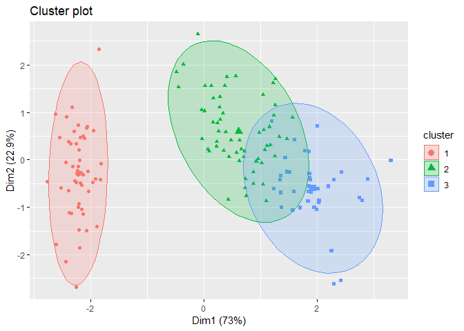
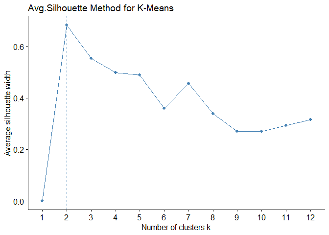
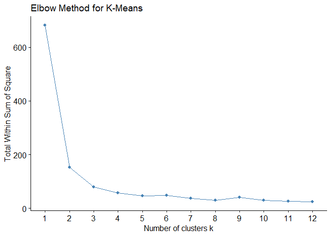

Day055
================

Clustering: <http://rpubs.com/skydome20/R-Note9-Clustering>

``` r
library(tidyverse)
```

``` r
glimpse(iris)
```

    ## Observations: 150
    ## Variables: 5
    ## $ Sepal.Length <dbl> 5.1, 4.9, 4.7, 4.6, 5.0, 5.4, 4.6, 5.0, 4.4, 4.9,...
    ## $ Sepal.Width  <dbl> 3.5, 3.0, 3.2, 3.1, 3.6, 3.9, 3.4, 3.4, 2.9, 3.1,...
    ## $ Petal.Length <dbl> 1.4, 1.4, 1.3, 1.5, 1.4, 1.7, 1.4, 1.5, 1.4, 1.5,...
    ## $ Petal.Width  <dbl> 0.2, 0.2, 0.2, 0.2, 0.2, 0.4, 0.3, 0.2, 0.2, 0.1,...
    ## $ Species      <fct> setosa, setosa, setosa, setosa, setosa, setosa, s...

``` r
data <- iris %>% select(-Species) # Remove target variable
```

Partitional Clustering
----------------------

K means

``` r
cluster <- kmeans(data, centers = 3)
cluster$withinss # Variance
```

    ## [1] 15.15100 39.82097 23.87947

Compare the cluster with real data

``` r
table(cluster$cluster, iris$Species)
```

    ##    
    ##     setosa versicolor virginica
    ##   1     50          0         0
    ##   2      0         48        14
    ##   3      0          2        36

``` r
# Data Visualization
require(factoextra)
```

    ## Loading required package: factoextra

    ## Welcome! Related Books: `Practical Guide To Cluster Analysis in R` at https://goo.gl/13EFCZ

``` r
fviz_cluster(cluster,
             data = data,
             geom = c("point", "label"),
             frame.type = "norm")
```



Optimal number of clusters
--------------------------

``` r
# Average Silhouette Method
fviz_nbclust(data, 
             FUNcluster = kmeans,   # K-Means
             method = "silhouette", # Avg. Silhouette
             k.max = 12             # max number of clusters
             ) +
labs(title="Avg.Silhouette Method for K-Means")
```



``` r
# Elbow Method
fviz_nbclust(data, 
             FUNcluster = kmeans,# K-Means
             method = "wss",     # total within sum of square
             k.max = 12          # max number of clusters to consider
             ) +
labs(title="Elbow Method for K-Means")
```


