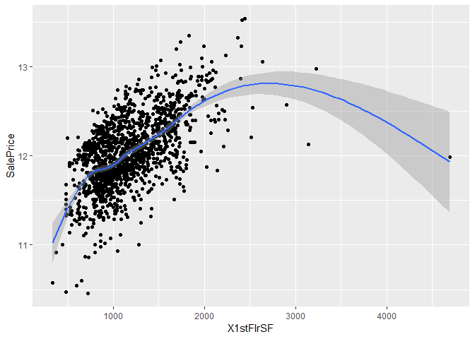
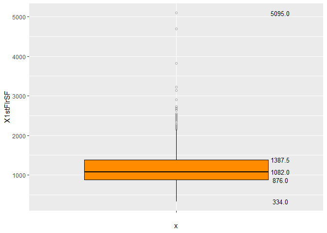
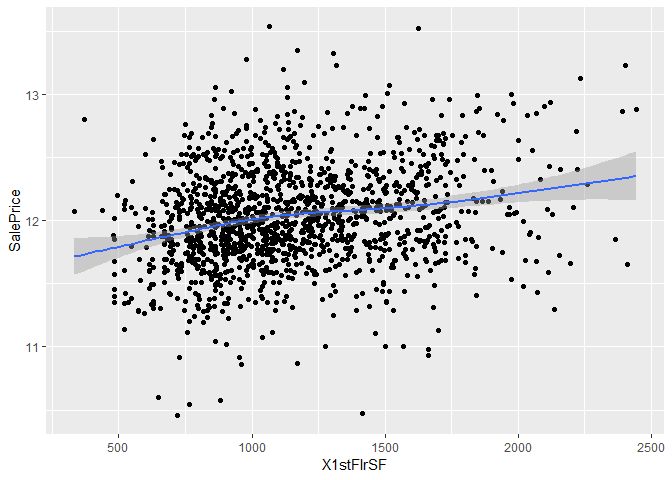

Day020
================

HW (Kaggle)房價預測精簡版
-------------------------

<https://www.kaggle.com/c/house-prices-advanced-regression-techniques>

Packages loading

``` r
library(purrr)
library(plyr)
library(tidyverse)
library(caret)
library(ROCR)
```

Data loading

``` r
df_train <- read.csv("data/house_train.csv")
df_test <- read.csv("data/house_test.csv")
sapply(list(df_train=df_train, df_test=df_test), dim) %>% 'rownames<-'(c('nrow','ncol')) 
```

    ##      df_train df_test
    ## nrow     1460    1459
    ## ncol       81      80

Setting training and testing data

``` r
train_y <-  log1p(df_train$SalePrice) 
ids <- df_test$PassengerId
df_train <- df_train %>% select(-c("SalePrice","Id"))
df_test <- df_test %>% select(-"Id")
df <- rbind(df_train, df_test)
head(df)
```

    ##   MSSubClass MSZoning LotFrontage LotArea Street Alley LotShape
    ## 1         60       RL          65    8450   Pave  <NA>      Reg
    ## 2         20       RL          80    9600   Pave  <NA>      Reg
    ## 3         60       RL          68   11250   Pave  <NA>      IR1
    ## 4         70       RL          60    9550   Pave  <NA>      IR1
    ## 5         60       RL          84   14260   Pave  <NA>      IR1
    ## 6         50       RL          85   14115   Pave  <NA>      IR1
    ##   LandContour Utilities LotConfig LandSlope Neighborhood Condition1
    ## 1         Lvl    AllPub    Inside       Gtl      CollgCr       Norm
    ## 2         Lvl    AllPub       FR2       Gtl      Veenker      Feedr
    ## 3         Lvl    AllPub    Inside       Gtl      CollgCr       Norm
    ## 4         Lvl    AllPub    Corner       Gtl      Crawfor       Norm
    ## 5         Lvl    AllPub       FR2       Gtl      NoRidge       Norm
    ## 6         Lvl    AllPub    Inside       Gtl      Mitchel       Norm
    ##   Condition2 BldgType HouseStyle OverallQual OverallCond YearBuilt
    ## 1       Norm     1Fam     2Story           7           5      2003
    ## 2       Norm     1Fam     1Story           6           8      1976
    ## 3       Norm     1Fam     2Story           7           5      2001
    ## 4       Norm     1Fam     2Story           7           5      1915
    ## 5       Norm     1Fam     2Story           8           5      2000
    ## 6       Norm     1Fam     1.5Fin           5           5      1993
    ##   YearRemodAdd RoofStyle RoofMatl Exterior1st Exterior2nd MasVnrType
    ## 1         2003     Gable  CompShg     VinylSd     VinylSd    BrkFace
    ## 2         1976     Gable  CompShg     MetalSd     MetalSd       None
    ## 3         2002     Gable  CompShg     VinylSd     VinylSd    BrkFace
    ## 4         1970     Gable  CompShg     Wd Sdng     Wd Shng       None
    ## 5         2000     Gable  CompShg     VinylSd     VinylSd    BrkFace
    ## 6         1995     Gable  CompShg     VinylSd     VinylSd       None
    ##   MasVnrArea ExterQual ExterCond Foundation BsmtQual BsmtCond BsmtExposure
    ## 1        196        Gd        TA      PConc       Gd       TA           No
    ## 2          0        TA        TA     CBlock       Gd       TA           Gd
    ## 3        162        Gd        TA      PConc       Gd       TA           Mn
    ## 4          0        TA        TA     BrkTil       TA       Gd           No
    ## 5        350        Gd        TA      PConc       Gd       TA           Av
    ## 6          0        TA        TA       Wood       Gd       TA           No
    ##   BsmtFinType1 BsmtFinSF1 BsmtFinType2 BsmtFinSF2 BsmtUnfSF TotalBsmtSF
    ## 1          GLQ        706          Unf          0       150         856
    ## 2          ALQ        978          Unf          0       284        1262
    ## 3          GLQ        486          Unf          0       434         920
    ## 4          ALQ        216          Unf          0       540         756
    ## 5          GLQ        655          Unf          0       490        1145
    ## 6          GLQ        732          Unf          0        64         796
    ##   Heating HeatingQC CentralAir Electrical X1stFlrSF X2ndFlrSF LowQualFinSF
    ## 1    GasA        Ex          Y      SBrkr       856       854            0
    ## 2    GasA        Ex          Y      SBrkr      1262         0            0
    ## 3    GasA        Ex          Y      SBrkr       920       866            0
    ## 4    GasA        Gd          Y      SBrkr       961       756            0
    ## 5    GasA        Ex          Y      SBrkr      1145      1053            0
    ## 6    GasA        Ex          Y      SBrkr       796       566            0
    ##   GrLivArea BsmtFullBath BsmtHalfBath FullBath HalfBath BedroomAbvGr
    ## 1      1710            1            0        2        1            3
    ## 2      1262            0            1        2        0            3
    ## 3      1786            1            0        2        1            3
    ## 4      1717            1            0        1        0            3
    ## 5      2198            1            0        2        1            4
    ## 6      1362            1            0        1        1            1
    ##   KitchenAbvGr KitchenQual TotRmsAbvGrd Functional Fireplaces FireplaceQu
    ## 1            1          Gd            8        Typ          0        <NA>
    ## 2            1          TA            6        Typ          1          TA
    ## 3            1          Gd            6        Typ          1          TA
    ## 4            1          Gd            7        Typ          1          Gd
    ## 5            1          Gd            9        Typ          1          TA
    ## 6            1          TA            5        Typ          0        <NA>
    ##   GarageType GarageYrBlt GarageFinish GarageCars GarageArea GarageQual
    ## 1     Attchd        2003          RFn          2        548         TA
    ## 2     Attchd        1976          RFn          2        460         TA
    ## 3     Attchd        2001          RFn          2        608         TA
    ## 4     Detchd        1998          Unf          3        642         TA
    ## 5     Attchd        2000          RFn          3        836         TA
    ## 6     Attchd        1993          Unf          2        480         TA
    ##   GarageCond PavedDrive WoodDeckSF OpenPorchSF EnclosedPorch X3SsnPorch
    ## 1         TA          Y          0          61             0          0
    ## 2         TA          Y        298           0             0          0
    ## 3         TA          Y          0          42             0          0
    ## 4         TA          Y          0          35           272          0
    ## 5         TA          Y        192          84             0          0
    ## 6         TA          Y         40          30             0        320
    ##   ScreenPorch PoolArea PoolQC Fence MiscFeature MiscVal MoSold YrSold
    ## 1           0        0   <NA>  <NA>        <NA>       0      2   2008
    ## 2           0        0   <NA>  <NA>        <NA>       0      5   2007
    ## 3           0        0   <NA>  <NA>        <NA>       0      9   2008
    ## 4           0        0   <NA>  <NA>        <NA>       0      2   2006
    ## 5           0        0   <NA>  <NA>        <NA>       0     12   2008
    ## 6           0        0   <NA> MnPrv        Shed     700     10   2009
    ##   SaleType SaleCondition
    ## 1       WD        Normal
    ## 2       WD        Normal
    ## 3       WD        Normal
    ## 4       WD       Abnorml
    ## 5       WD        Normal
    ## 6       WD        Normal

秀出資料欄位的類型與數量

``` r
table(sapply(df, class))
```

    ## 
    ##  factor integer 
    ##      43      36

確定只有 integer, numeric, factor 三種類型後, 分別將欄位名稱存於三個 vector 中

``` r
feature_type <- sapply(df, class)
int_var <- feature_type[which(feature_type == "integer")] %>% as.data.frame %>% rownames
fac_var <- feature_type[which(feature_type == "factor")] %>% as.data.frame %>% rownames
list(integer_feature = int_var,
     factor_feature = fac_var)
```

    ## $integer_feature
    ##  [1] "MSSubClass"    "LotFrontage"   "LotArea"       "OverallQual"  
    ##  [5] "OverallCond"   "YearBuilt"     "YearRemodAdd"  "MasVnrArea"   
    ##  [9] "BsmtFinSF1"    "BsmtFinSF2"    "BsmtUnfSF"     "TotalBsmtSF"  
    ## [13] "X1stFlrSF"     "X2ndFlrSF"     "LowQualFinSF"  "GrLivArea"    
    ## [17] "BsmtFullBath"  "BsmtHalfBath"  "FullBath"      "HalfBath"     
    ## [21] "BedroomAbvGr"  "KitchenAbvGr"  "TotRmsAbvGrd"  "Fireplaces"   
    ## [25] "GarageYrBlt"   "GarageCars"    "GarageArea"    "WoodDeckSF"   
    ## [29] "OpenPorchSF"   "EnclosedPorch" "X3SsnPorch"    "ScreenPorch"  
    ## [33] "PoolArea"      "MiscVal"       "MoSold"        "YrSold"       
    ## 
    ## $factor_feature
    ##  [1] "MSZoning"      "Street"        "Alley"         "LotShape"     
    ##  [5] "LandContour"   "Utilities"     "LotConfig"     "LandSlope"    
    ##  [9] "Neighborhood"  "Condition1"    "Condition2"    "BldgType"     
    ## [13] "HouseStyle"    "RoofStyle"     "RoofMatl"      "Exterior1st"  
    ## [17] "Exterior2nd"   "MasVnrType"    "ExterQual"     "ExterCond"    
    ## [21] "Foundation"    "BsmtQual"      "BsmtCond"      "BsmtExposure" 
    ## [25] "BsmtFinType1"  "BsmtFinType2"  "Heating"       "HeatingQC"    
    ## [29] "CentralAir"    "Electrical"    "KitchenQual"   "Functional"   
    ## [33] "FireplaceQu"   "GarageType"    "GarageFinish"  "GarageQual"   
    ## [37] "GarageCond"    "PavedDrive"    "PoolQC"        "Fence"        
    ## [41] "MiscFeature"   "SaleType"      "SaleCondition"

削減文字型欄位, 只剩數值型欄位

``` r
df <- df %>% select(-fac_var)
train_num <- length(train_y)
head(df)
```

    ##   MSSubClass LotFrontage LotArea OverallQual OverallCond YearBuilt
    ## 1         60          65    8450           7           5      2003
    ## 2         20          80    9600           6           8      1976
    ## 3         60          68   11250           7           5      2001
    ## 4         70          60    9550           7           5      1915
    ## 5         60          84   14260           8           5      2000
    ## 6         50          85   14115           5           5      1993
    ##   YearRemodAdd MasVnrArea BsmtFinSF1 BsmtFinSF2 BsmtUnfSF TotalBsmtSF
    ## 1         2003        196        706          0       150         856
    ## 2         1976          0        978          0       284        1262
    ## 3         2002        162        486          0       434         920
    ## 4         1970          0        216          0       540         756
    ## 5         2000        350        655          0       490        1145
    ## 6         1995          0        732          0        64         796
    ##   X1stFlrSF X2ndFlrSF LowQualFinSF GrLivArea BsmtFullBath BsmtHalfBath
    ## 1       856       854            0      1710            1            0
    ## 2      1262         0            0      1262            0            1
    ## 3       920       866            0      1786            1            0
    ## 4       961       756            0      1717            1            0
    ## 5      1145      1053            0      2198            1            0
    ## 6       796       566            0      1362            1            0
    ##   FullBath HalfBath BedroomAbvGr KitchenAbvGr TotRmsAbvGrd Fireplaces
    ## 1        2        1            3            1            8          0
    ## 2        2        0            3            1            6          1
    ## 3        2        1            3            1            6          1
    ## 4        1        0            3            1            7          1
    ## 5        2        1            4            1            9          1
    ## 6        1        1            1            1            5          0
    ##   GarageYrBlt GarageCars GarageArea WoodDeckSF OpenPorchSF EnclosedPorch
    ## 1        2003          2        548          0          61             0
    ## 2        1976          2        460        298           0             0
    ## 3        2001          2        608          0          42             0
    ## 4        1998          3        642          0          35           272
    ## 5        2000          3        836        192          84             0
    ## 6        1993          2        480         40          30             0
    ##   X3SsnPorch ScreenPorch PoolArea MiscVal MoSold YrSold
    ## 1          0           0        0       0      2   2008
    ## 2          0           0        0       0      5   2007
    ## 3          0           0        0       0      9   2008
    ## 4          0           0        0       0      2   2006
    ## 5          0           0        0       0     12   2008
    ## 6        320           0        0     700     10   2009

作業1
-----

試著限制 '1樓地板面積(平方英尺)' (1stFlrSF) 欄位的上下限, 看看能否再進一步提高分數?

``` r
# 顯示 1stFlrSF 與目標值的散佈圖
df[1:train_num,] %>%
  mutate(SalePrice = train_y) %>%
  ggplot(aes(x = X1stFlrSF, y = SalePrice)) +
  geom_point() +
  geom_smooth()
```

    ## `geom_smooth()` using method = 'gam' and formula 'y ~ s(x, bs = "cs")'



``` r
# 做線性迴歸, 觀察分數
df_m1 <- df %>% replace(., is.na(.), -1) # 缺失值補-1
train_x <- df_m1[1:train_num,] 
normal <- preProcess(train_x, method = "range", rangeBounds = c(0,1)) # 最小最大化
train_normal <- predict(normal, train_x)
train <- train_normal %>% mutate(SalePrice = train_y)
control <- trainControl(method="cv", number=5) # 交叉驗證, folds=5
fit <- train(SalePrice~., data=train, method="lm", metric="Rsquared", trControl=control)
# display results
print(fit)
```

    ## Linear Regression 
    ## 
    ## 1460 samples
    ##   36 predictor
    ## 
    ## No pre-processing
    ## Resampling: Cross-Validated (5 fold) 
    ## Summary of sample sizes: 1169, 1168, 1166, 1168, 1169 
    ## Resampling results:
    ## 
    ##   RMSE       Rsquared   MAE      
    ##   0.1566322  0.8472777  0.1003339
    ## 
    ## Tuning parameter 'intercept' was held constant at a value of TRUE

``` r
ggplot(data = df, aes(x = "", y = X1stFlrSF)) + 
  geom_boxplot(notch = F, outlier.color = "darkgrey", outlier.shape = 1,
                 color = "black", fill = "darkorange", varwidth = T) +
  stat_summary(geom = "text", fun.y = quantile,
                 aes(label=sprintf("%1.1f", ..y..)),
                 position=position_nudge(x=0.425), size=3.5)
```



``` r
# 將 X1stFlrSF 限制在 0 到 2500 以內, 捨棄離群值
df_filter <- df %>% 
  filter(X1stFlrSF>0 & X1stFlrSF<=2500)

df_filter[1:train_num,] %>%
  mutate(SalePrice = train_y) %>%
  ggplot(aes(x = X1stFlrSF, y = SalePrice)) +
  geom_point() +
  geom_smooth()
```

    ## `geom_smooth()` using method = 'gam' and formula 'y ~ s(x, bs = "cs")'



``` r
# 做線性迴歸, 觀察分數
df_m1 <- df %>% replace(., is.na(.), -1)
train_filter <- df_m1[1:train_num,] %>%
  mutate(SalePrice = train_y) %>%
  filter(X1stFlrSF>0 & X1stFlrSF<=2500)

 
normal <- preProcess(train_filter, method = "range", rangeBounds = c(0,1))
train_filter <- predict(normal, train_filter)
control <- trainControl(method="cv", number=5)
fit <- train(SalePrice~., data=train_filter, method="lm", metric="Rsquared", trControl=control)
# display results
print(fit)
```

    ## Linear Regression 
    ## 
    ## 1453 samples
    ##   36 predictor
    ## 
    ## No pre-processing
    ## Resampling: Cross-Validated (5 fold) 
    ## Summary of sample sizes: 1162, 1162, 1162, 1163, 1163 
    ## Resampling results:
    ## 
    ##   RMSE        Rsquared  MAE      
    ##   0.04197837  0.895198  0.0293876
    ## 
    ## Tuning parameter 'intercept' was held constant at a value of TRUE
