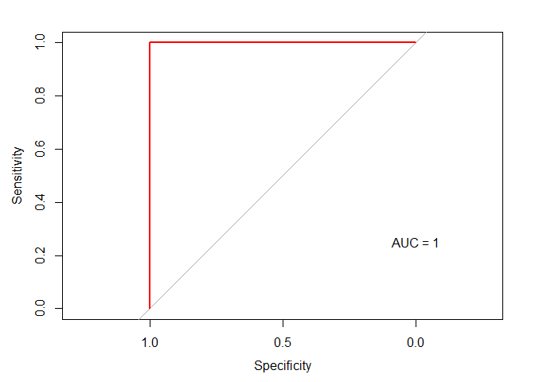

Day021
================

Visiting: Categorical Features and Encoding in Decision Trees: <https://medium.com/data-design/visiting-categorical-features-and-encoding-in-decision-trees-53400fa65931>

HW (Kaggle)鐵達尼生存預測精簡版
-------------------------------

<https://www.kaggle.com/c/titanic>

Packages loading

``` r
library(purrr)
library(plyr)
library(tidyverse)
library(caret)
library(pROC)
```

Data loading

``` r
df_train <- read.csv("data/titanic_train.csv")
df_test <- read.csv("data/titanic_test.csv")
sapply(list(df_train=df_train, df_test=df_test), dim) %>% 'rownames<-'(c('nrow','ncol')) 
```

    ##      df_train df_test
    ## nrow      891     418
    ## ncol       12      11

Setting training and testing data

``` r
train_y <- df_train$Survived
ids <- df_test$PassengerId
df_train <- df_train %>% select(-c("Survived","PassengerId"))
df_test <- df_test %>% select(-"PassengerId")
df <- rbind(df_train, df_test)
```

秀出資料欄位的類型與數量

``` r
table(sapply(df, class))
```

    ## 
    ##  factor integer numeric 
    ##       5       3       2

確定只有 integer, numeric, factor 三種類型後, 分別將欄位名稱存於三個 vector 中

``` r
feature_type <- sapply(df, class)
int_var <- feature_type[which(feature_type == "integer")] %>% as.data.frame %>% rownames
num_var <- feature_type[which(feature_type == "numeric")] %>% as.data.frame %>% rownames
fac_var <- feature_type[which(feature_type == "factor")] %>% as.data.frame %>% rownames
list(integer_feature = int_var,
     numeric_feature = num_var,
     factor_feature = fac_var)
```

    ## $integer_feature
    ## [1] "Pclass" "SibSp"  "Parch" 
    ## 
    ## $numeric_feature
    ## [1] "Age"  "Fare"
    ## 
    ## $factor_feature
    ## [1] "Name"     "Sex"      "Ticket"   "Cabin"    "Embarked"

只留文字型欄位

``` r
df <- df %>% select(fac_var)
train_num <- length(train_y)

feature.names <- colnames(df)
for (f in feature.names) {
  df[[f]] <- mapvalues(df[[f]], from="", to="None")
}
```

    ## The following `from` values were not present in `x`: 
    ## The following `from` values were not present in `x`: 
    ## The following `from` values were not present in `x`:

Label encoding

``` r
feature.names <- colnames(df)
count <- 0

df_le <- df
# Iterate through the columns
for (f in feature.names) {
  levels <- df[[f]] %>% unlist() %>% levels()
  df_le[[f]] <- mapvalues(df[[f]], from=levels, to=seq_along(levels)) %>% as.integer()
  count <- count + 1
}
```

One-hot encoding

``` r
df_dmy <- dummyVars("~.", data = df)
df_ohe <- data.frame(predict(df_dmy, newdata = df))
```

Logistic Regression + Label encoding

``` r
train_le <- df_le[1:train_num,] %>% mutate(Survived = as.factor(train_y))
levels(train_le$Survived) <- make.names(levels(factor(train_le$Survived)))
control <- trainControl(method="cv", number=5, classProbs=TRUE, summaryFunction=twoClassSummary)
fit_le <- train(Survived~., data=train_le, method="glm", metric="ROC", trControl=control)
# display results
print(fit_le)
```

    ## Generalized Linear Model 
    ## 
    ## 891 samples
    ##   5 predictor
    ##   2 classes: 'X0', 'X1' 
    ## 
    ## No pre-processing
    ## Resampling: Cross-Validated (5 fold) 
    ## Summary of sample sizes: 713, 713, 713, 712, 713 
    ## Resampling results:
    ## 
    ##   ROC        Sens       Spec     
    ##   0.8354438  0.8287406  0.7164109

``` r
glm.probs <- predict(fit_le, data = train_le$Survived, type = "prob")
glm.ROC <- roc(response = train_le$Survived,
               predictor = glm.probs$X1,
               levels = levels(train_le$Survived))
plot(glm.ROC, type="S", col="red"); text(x=0, y=.25, labels=paste("AUC =", round(glm.ROC$auc, 4)))
```


Logistic Regression + One-hot encoding

``` r
train_ohc <- df_ohe[1:train_num,] %>% mutate(Survived = as.factor(train_y))
levels(train_ohc$Survived) <- make.names(levels(factor(train_ohc$Survived)))
control <- trainControl(method="repeatedcv", number=5, classProbs=TRUE, summaryFunction=twoClassSummary)
fit_ohc <- train(Survived~., data=train_ohc, method="glmnet", metric="ROC", trControl=control)
# display results
print(fit_ohc)
```

    ## glmnet 
    ## 
    ##  891 samples
    ## 2429 predictors
    ##    2 classes: 'X0', 'X1' 
    ## 
    ## No pre-processing
    ## Resampling: Cross-Validated (5 fold, repeated 1 times) 
    ## Summary of sample sizes: 713, 712, 713, 713, 713 
    ## Resampling results across tuning parameters:
    ## 
    ##   alpha  lambda      ROC        Sens       Spec     
    ##   0.10   0.01671215  0.8612871  0.8925104  0.6871697
    ##   0.10   0.05284845  0.8615881  0.8797665  0.6871697
    ##   0.10   0.16712149  0.8531605  0.8761301  0.6812873
    ##   0.55   0.01671215  0.8536920  0.8615680  0.6900682
    ##   0.55   0.05284845  0.8450843  0.8542619  0.6812873
    ##   0.55   0.16712149  0.8209398  0.8524437  0.6812873
    ##   1.00   0.01671215  0.8486016  0.8670392  0.6871270
    ##   1.00   0.05284845  0.8216389  0.8524437  0.6812873
    ##   1.00   0.16712149  0.7668655  0.8524437  0.6812873
    ## 
    ## ROC was used to select the optimal model using the largest value.
    ## The final values used for the model were alpha = 0.1 and lambda
    ##  = 0.05284845.

``` r
glm.probs2 <- predict(fit_ohc, s = 'lambda.min', data = train_ohc$Survived, type = "prob")
glm.ROC2 <- roc(response = train_ohc$Survived,
                predictor = glm.probs2$X1,
                levels = levels(train_ohc$Survived))
plot(glm.ROC2, type="S", col="red"); text(x=0, y=.25, labels=paste("AUC =", round(glm.ROC2$auc, 4)))
```


